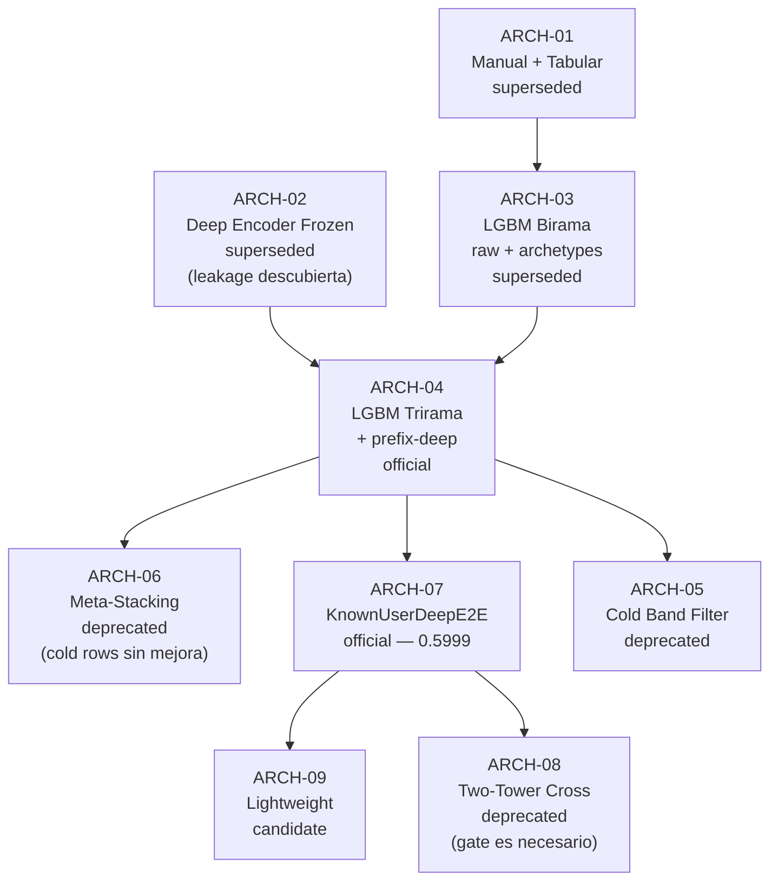

# Catalogo De Arquitecturas — Content-Based

- Proposito: inventariar todas las arquitecturas distintas que han sido implementadas y evaluadas en la rama `content-based`, incluyendo variantes de input/output aunque compartan el mismo bloque central.
- Tipo documental: `current`
- Ultima actualizacion: `2026-04-16`

## Regla De Entrada

Una arquitectura nueva se registra cuando:
- El bloque central de computacion es diferente (red distinta, modelo distinto, mecanismo de agregacion distinto), O
- Los inputs o outputs cambian de forma que modifican el contrato de la prediccion (features distintas, signal adicional, dominio de salida distinto).

Si dos experimentos usan exactamente el mismo codigo con distintos hiperparametros pero el mismo contrato input/output, cuentan como una sola arquitectura.

---

## ARCH-01 — Representacion Manual De Usuario + Regressor Tabular

**Estado**: `superseded`
**Primera evaluacion**: sesion 2026-04-10
**Artefactos representativos**: previos a `lgbm_raw_router_v1`

### Descripcion

El perfil del usuario se construye manualmente agregando los negocios valorados previamente. No hay componente deep.

```
usuarios.csv + negocios.csv + train_reviews.csv
        ↓
  user_representation.py
        ↓
  user_profile_features  (content mean / rating / centered / recency)
  user_metadata_features (metadata segura)
  user_full_features
        ↓
  Regressor tabular (LightGBM o Ridge)
        ↓
  prediccion: rating continuo [1.0–5.0]
```

### Inputs

- `usuarios.csv`: metadata de usuario
- `negocios.csv`: metadata de negocio
- `train_reviews.csv`: historial de reviews para construir el perfil del usuario

### Outputs

- prediccion de rating continuo para cada (usuario, negocio) de test

### Limitacion que llevo a la siguiente arquitectura

El perfil agregado del usuario no tenia en cuenta la secuencia ni la temporalidad. El cold start (usuarios sin historial) no tenia señal de usuario util. La representacion de negocio era solo metadata directa de `negocios.csv`.

---

## ARCH-02 — Deep User Encoder + Frozen Downstream

**Estado**: `superseded`
**Primera evaluacion**: sesion 2026-04-10 (`competition_embeddings_v3_iter03`)
**Artefactos representativos**: `competition_embeddings_v3_iter03`, `frozen_embedding_regressor_v1`

### Descripcion

Se entrena un encoder profundo de usuario (con historial de ratings y metadata) y se exportan embeddings estáticos. El downstream usa esos embeddings congelados.

```
train_reviews.csv (historial completo para entrenamiento del encoder)
        ↓
  DeepUserRatingModel (deep_user_encoder.py)
    ├── business_tower     (comparte pesos para historial y candidato)
    ├── rating_encoder
    ├── history_content_gate + history_rating_gate
    ├── history_residual_encoder
    ├── metadata_encoder + base_user_encoder
    ├── history_shrinkage_gate
    ├── user_fusion
    └── scorer
        ↓
  export: user_deep_features.npz + business_deep_features.npz
        ↓
  FrozenEmbeddingRegressor (downstream)
    ├── user_tower (sobre embeddings congelados)
    ├── business_tower (sobre embeddings congelados)
    └── scorer / regressor head
        ↓
  prediccion: rating continuo
```

### Inputs del encoder

- Historial: `(business_content_features, rating, days_since_interaction)` para max 20 reviews previas
- Metadata de usuario: `user_average_stars`, `user_review_count`, `user_tenure_days`, ...

### Inputs del downstream (frozen)

- `user_deep_features` (embedding fijo del usuario, exportado con historial completo)
- `business_deep_features` (embedding fijo del negocio)
- `review_context`: features escalares de la review objetivo

### Outputs

- prediccion de rating continuo

### Limitacion identificada

El embedding de usuario exportado incluia el historial completo de train. En evaluacion temporal, el embedding de un usuario en "banda 1" ya contenia su propia review objetivo (audit: `frozen-embedding-regressor-leak-audit-2026-04-10.md`). La arquitectura downstream congelada era correcta pero el embedding de entrada estaba contaminado en el split temporal.

---

## ARCH-03 — Router LGBM Birama: known_model + cold_model (Raw Core)

**Estado**: `superseded`
**Primera evaluacion**: sesion 2026-04-11
**Artefactos representativos**: `lgbm_raw_router_v1` (primera version sin prefix-deep)

### Descripcion

Primer router duro con dos ramas: una para usuarios conocidos (raw features) y otra para cold start (metadata-only con arquetipos K-Means).

```
train_reviews.csv + usuarios.csv + negocios.csv
        ↓
  fit_router_feature_spec()
    ├── RawLGBMFeatureSpec (raw_core features: priors, tenure, biz metadata, temporal)
    ├── MiniBatchKMeans(n_clusters=64) sobre 9 features de usuario
    └── Priors de arquetipo × facet de negocio (estado, ciudad, star_bin, open, categoria)
        ↓
  build_router_feature_frame()
    ├── ~80 features para known_model
    └── ~105 features para cold_model (raw_core + archetipos + priors arquetipos)
        ↓
  ┌─────────────────────────────────────┐
  │ Router duro (history_band)          │
  │  band 0 → cold_model  (LightGBM)   │
  │  band ≥1 → known_model (LightGBM)  │
  └─────────────────────────────────────┘
        ↓
  prediccion redondeada [1–5]
```

### Inputs

- Cold model: raw features + `user_archetype_id` + 6 tablas de priors arquetipo × negocio + gaps
- Known model: raw features completas sin arquetipos

### Outputs

- prediccion redondeada [1–5] por rama

### Variante de input notable: `lgbm_train_stars_v1`

Misma arquitectura birama, pero `user_average_stars` se reemplaza por la media calculada solo desde `train_reviews` antes de pasarla al spec. El resto del pipeline es identico. Ver [`reference/user-average-stars-leakage-analysis.md`](/C:/Users/mario/OneDrive/Documentos/UPM/Master_Data/Sistemas_recomendacion/recomendation-system/docs/reference/user-average-stars-leakage-analysis.md).

---

## ARCH-04 — Router LGBM Trirama: cold + known + known_prefix_deep

**Estado**: `official` — router base del sistema actual
**Primera evaluacion**: sesion 2026-04-11
**Artefactos representativos**: `lgbm_raw_router_prefix_deep_v1`

### Descripcion

Extension del router birama que añade una tercera rama para usuarios conocidos con historial medio, usando features derivadas de embeddings deep del negocio.

```
[ARCH-03: cold_model + known_model]
        +
  competition_embeddings_v3_iter03 (bundle de embeddings de negocio)
        ↓
  known_prefix_deep_model (LightGBM)
    inputs adicionales: 545 features de prefijo de historial
      ├── embeddings del candidato (business_deep_features 128-dim)
      ├── similitudes coseno candidato vs cada review del historial
      ├── distancias L2 candidato vs historial
      ├── estadisticas escalares del prefijo (recencia, rating stats, etc.)
      └── user_aux_features (history_count, history_rating_mean, ...)
        ↓
  ┌──────────────────────────────────────────────────┐
  │ Router duro (history_band)                       │
  │  band 0      → cold_model                        │
  │  band 6-20   → known_prefix_deep_model (si activ)│
  │  band ≥1     → known_model (fallback)            │
  └──────────────────────────────────────────────────┘
        ↓
  prediccion redondeada [1–5]
```

### Inputs diferenciales vs ARCH-03

- `known_prefix_deep_model` recibe 545 features de prefijo construidas desde `competition_embeddings_v3_iter03`
- La activacion por banda se decide por validacion (margen ≥ 0.005); en `prefix_deep_v1` solo `6-20` queda activada

### Variantes de input evaluadas

| Artefacto | Diferencia en inputs | Resultado |
|---|---|---|
| `lgbm_feature_first_short_router_v1_gpu` | Prefix features para todas las bandas (1, 2-5, 6-20), sin filtro de banda en cold training | val MAE rounded = 0.6254 |
| `lgbm_feature_first_short_router_v2_gpu_conservative` | Como v1 pero con blending conservador de prefix features | val MAE rounded = **0.6247** — mejor LGBM |
| `lgbm_hybrid_conservative_v1` | Blending hibrido distinto | val MAE rounded = 0.6265 |
| `lgbm_transition_blend_router_v1` | Blending transition para bandas intermedias | val MAE rounded = 0.6270 |
| `lgbm_router_v6` | Añade 32 features PCA de `business_content_features.npz` al cold_model | cold MAE 1.1315 (−0.027 vs baseline) — submission incompleta |
| `lgbm_router_v9_cold_signals` | Añade CF item bias + 108 features al cold_model | val MAE rounded = 0.6557 — peor |
| `lgbm_router_v10_cf_archetype` | v9 + archetype distances | val MAE rounded = 0.6557 — sin mejora |
| `lgbm_tabular_moe_prefixsafe_run1` | MoE tabular con prefix-safe branches | val MAE rounded = 0.6784 — malo |

---

## ARCH-05 — Cold Model Con Filtro De Banda De Entrenamiento

**Estado**: `deprecated`
**Primera evaluacion**: sesion 2026-04-14 (ciclo v2–v5)
**Artefactos representativos**: `lgbm_router_v2`, `lgbm_router_v3`, `lgbm_router_v4`, `lgbm_router_v5`

### Descripcion

Variante del cold_model de ARCH-03/04 donde el conjunto de entrenamiento del cold_model se filtra por banda de historial. La hipotesis era que entrenar solo con filas de baja historia (bands 1, 2-5) mejoraria la generalizacion sobre usuarios cold genuinos.

```
train_reviews.csv filtrado por history_band ∈ {1, 2-5}
        ↓
  cold_model (LightGBM)
    variantes evaluadas:
      ├── n_archetypes=32/64/128
      ├── con/sin business_train_stats (biz mean/std desde train_reviews)
      └── filtro --cold-training-max-band {2-5, 6-20, >20, all}
        ↓
  mismo router duro que ARCH-03
```

### Resultados clave

| Run | Archetypes | Biz stats | Training bands | Cold MAE |
|---|---:|---|---|---:|
| `lgbm_train_stars_v1` (base) | 64 | — | all | 1.1588 |
| `lgbm_router_v5` | 64 | — | all | **1.1494** ← mejor |
| `lgbm_router_v2` | 128 | ✓ | 1+2-5 | 1.2185 ← peor |

Conclusion: el filtro de banda empeora el cold model porque reduce drasticamente los datos de entrenamiento. Las biz_train_stats no aportaron. Solo un ligero ajuste de hiperparametros (v5) redujo el cold MAE marginalmente.

---

## ARCH-06 — Meta-Stacking: LGBM Corrector Sobre CB Router

**Estado**: `deprecated`
**Primera evaluacion**: sesion 2026-04-14 (ciclo meta v1–v6)
**Artefactos representativos**: `meta_lgbm_hybrid_v1` … `meta_lgbm_hybrid_v6`

### Descripcion

Una capa de meta-modelo LightGBM que toma como input la prediccion del router CB (ARCH-04) y señales CF adicionales, y produce una prediccion final corregida.

```
[Prediccion del router ARCH-04]  ← cb_pred
[CF SVD model]                   ← user_bias, item_bias (cf_meta_model_v1/v2)
[Features adicionales]           ← user_total_votes, cb_pred_fractional_part, etc.
        ↓
  LightGBM corrector (meta_lgbm_hybrid)
        ↓
  prediccion final: rating redondeado [1–5]
```

### Variantes de input evaluadas

| Version | Inputs principales | Val MAE | LB MAE |
|---|---|---:|---:|
| v1 (CB+CF) | `cb_pred`, `user_bias`, `item_bias` (3 features) | ~0.665 | **0.6528** |
| v2 (fix CF direction) | v1 + corrección de signo CF | 0.687 | — |
| v3 (CB+bias sin CF) | `cb_pred` + user/biz metadata (sin CF) | 0.673 | — |
| v4 (19 features) | v1 + `cb_pred_fractional_part`, `correction_hat`, votos, temporales | **0.664** | 0.6529 |
| v5 (joint all-bands) | v4 + prior bayesiano negocio para cold rows | 0.914 | 0.8565 |
| v6 (dos modelos) | known y cold por separado | 0.665/1.017 | — |

### Output diferencial vs ARCH-04

La salida es idéntica (rating redondeado [1–5]), pero el mecanismo es corrección sobre la prediccion del router en lugar de prediccion directa. La diferencia critica en v5: el meta sobrescribia las predicciones cold del router con un prior bayesiano debil → catastrófico.

---

## ARCH-07 — KnownUserDeepE2E: Corrector Deep Gated Sobre Incumbent

**Estado**: `official` — mejor arquitectura deep conocida
**Primera evaluacion**: sesion 2026-04-13 (ciclo v1–v2_eval_v3)
**Artefactos representativos**: `known_user_deep_router_v2_eval_v3` (mejor), `known_user_deep_router_v4_eval_v1`

### Descripcion

Un red profunda que aprende una **correccion residual acotada** sobre la prediccion del incumbent LGBM. El corrector tiene expertos separados por banda de historial y usa un gate sigmoidal para controlar la magnitud de la corrección.

```
inputs por fila:
  ├── business_content_features (desde competition_embeddings_v3_iter03)
  ├── incumbent_prediction_raw  (prediccion del LGBM incumbent)
  ├── event_scalar_features     (rating historial, recencia, like/dislike flags)
  ├── user_numeric_features     (tenure, votes, engagement, etc.)
  ├── user_aux_features         (history_count, rating stats del prefijo)
  └── user_type_categorical     (archetype_id, activity_bucket, etc.)
        ↓
  KnownUserDeepE2EModel
    ├── business_tower (business_content_features → embedding denso)
    ├── event_encoder  (event_scalar_features × max_history → per-event embedding)
    ├── user_type_encoder (categoricas → embedding)
    ├── history_attention (3 heads: general, positive, negative)
    ├── 5 band_taste_fusion experts (1, 2-3, 4-5, 6-20, >20)
    ├── baseline_head (prediccion auxiliar del incumbent)
    └── 5 band_gate_head + 5 band_correction_head
          ↓
  pred = sigmoid(alpha) × correction_scale × tanh(correction) + incumbent_prediction_raw
        ↓
  evaluacion: replace incumbent donde deep_mae < incumbent_mae por banda
        ↓
  router final: activar bandas con delta < 0 y margen suficiente
```

### Inputs (contrato estable desde v2_eval)

| Input | Dimensiones | Descripcion |
|---|---|---|
| `business_content_features` | 128-dim | embedding de negocio de competition_embeddings_v3_iter03 |
| `history_business_features` | `[batch, max_history=20, 128]` | embeddings de los negocios del historial |
| `history_ratings` | `[batch, 20]` | ratings del historial escalados |
| `history_mask` | `[batch, 20]` | mascara de padding |
| `history_recency` | `[batch, 20]` | dias desde cada interaccion |
| `user_numeric_features` | 42+ features | tenure, votes, fans, etc. |
| `user_aux_features` | 21 features | history_count, rating stats, etc. |
| `user_type_features` | 4 categoricas | archetype_id, activity_bucket, etc. |
| `event_scalar_features` | 9 escalares/evento | rating, liked_flag, days_since, etc. |
| `incumbent_prediction_raw` | escalar | prediccion del LGBM antes de redondear |
| `baseline_features` | ~80 features | features del LGBM incumbent para baseline_head |

### Outputs

- `predicted_rating`: correccion residual sobre incumbent, clamp a [1, 5]
- `baseline_hat`: prediccion auxiliar del incumbent (para distilacion)
- `alpha`: gate de magnitud de correccion

### Variantes de la funcion de perdida evaluadas

| Familia config | Loss principal | Resultado |
|---|---|---|
| v1 – v2_eval_v3 | `smooth_l1_loss` | Mejor resultado: final_overall_mae=**0.5999** |
| v3_feature_injected | `smooth_l1_loss` + features inyectadas | final_overall_mae=0.6025 |
| v4_eval | `smooth_l1_loss` + arquitectura split band | final_overall_mae=0.6008 |
| v5_direct | Sin gate (corrección libre) | Overfitting epoch 1 — gate es estabilizador |
| v6_regularized (C1) | Sin gate + L2 weight_decay=1e-3 | Mejor que v5 (epoch 5) pero sigue peor |
| v6_regularized (C2) | Con gate + correction_scale 1.2–1.5 | Overfitting epoch 1 |
| v7_mae (D1/D2) | `l1_loss` | Curva monotona estable; no supera 0.5999 |
| moe_eval | `smooth_l1_loss` + MoE (mixture-of-experts) | final_overall_mae=0.6018 |

### Variante de input notable: `v8_fixed` (catastrófico)

Mismo modelo, pero `user_average_stars` del incumbent fue reemplazado en inferencia sin reentrenar el LGBM → incumbent MAE banda 1 pasó de 0.680 a 1.161 → deep_mae 0.927. Ver [`experiments/new-architecture-dir-a-b-2026-04-14.md`](/C:/Users/mario/OneDrive/Documentos/UPM/Master_Data/Sistemas_recomendacion/recomendation-system/docs/experiments/new-architecture-dir-a-b-2026-04-14.md).

---

## ARCH-08 — KnownUserTwoTowerCross: Two-Tower + Cross Network + Prefix Memory

**Estado**: `deprecated` — primera iteracion fallida
**Primera evaluacion**: sesion 2026-04-12
**Artefactos representativos**: `known_user_two_tower_router_v2_eval_v2`

### Descripcion

Arquitectura alternativa al corrector gated (ARCH-07) que separa explicitamente la torre del candidato y la torre del historial del usuario, con un bloque cross network para modelar interacciones explícitas usuario-candidato.

```
inputs:
  ├── candidate_business_features (metadata estructurada del candidato)
  ├── history_business_features   (embeddings de historial)
  ├── history_ratings + mask
  ├── user_numeric + user_type_features
  └── incumbent_prediction_raw

  KnownUserTwoTowerCrossModel
    ├── candidate_tower   (torre de negocio candidato — separada del historial)
    ├── history_tower     (torre compartida por los negocios del historial)
    ├── prefix_memory     (atencion sobre el historial → vector de usuario)
    ├── cross_network     (interacciones explicitas entre user_embedding y candidate_embedding)
    └── correction_head   (salida residual sobre incumbent)
        ↓
  pred = correction + incumbent_prediction_raw
```

### Diferencia clave vs ARCH-07

| Aspecto | ARCH-07 (E2E gated) | ARCH-08 (Two-Tower Cross) |
|---|---|---|
| Separacion candidato/historial | Misma `business_tower` compartida | Torres separadas explicitamente |
| Mecanismo de correccion | `sigmoid(alpha) × tanh(correction)` acotado | Correccion libre sobre incumbent |
| Interaccion usuario-candidato | Implícita via atencion compartida | Explícita via cross network |
| Resultado (val MAE) | **0.6694** (mejor) | 0.6890 (+0.0196 vs incumbent) |
| Bandas activadas | 1, 2-5, 6-20, >20 | Ninguna |

### Conclusion

El cross network y la separacion de torres no mejoraron el MAE. El corrector sin gate (libre) introdujo degradacion en todas las bandas, especialmente `>20`. Lección: el gate es un estabilizador necesario, no un bottleneck.

---

## ARCH-09 — KnownUserDeepE2E Lightweight: Corrector Compacto (~200k params)

**Estado**: `candidate` (runA) / `in-progress` (runC)
**Primera evaluacion**: sesion 2026-04-15
**Artefactos representativos**: `known_user_deep_lightweight_v1`, `known_user_deep_v_lightweight_v2`

### Descripcion

Misma arquitectura que ARCH-07 (`KnownUserDeepE2EModel`) pero con dimensiones radicalmente reducidas. Motivacion: el modelo completo tiene 3.28M params con ~338k ejemplos → ratio 0.10 ej/param. El modelo lightweight tiene ~200k params → ratio ~1.7 ej/param.

```
misma estructura que ARCH-07, con:
  embedding_dim:      128 → 32
  business_tower:     (512, 384, 256) → (64,)
  scorer_hidden:      (256, 128) → (64, 32)
  attention_heads:    4 → 2
  5 band experts:     (reducidos proporcionalmente)
```

### Inputs

Identicos a ARCH-07. El contrato de datos no cambia.

### Diferencia de output

La magnitud de corrección es más conservadora por la menor capacidad del modelo. El gate sigue presente.

### Variante v_ultralight (~50k params)

```
  embedding_dim: 32 → 16
  resto de reduccion proporcional
```

### Resultados por variante

| Config | Params | Best epoch | Val MAE | Delta banda 6-20 |
|---|---:|---:|---:|---:|
| ARCH-07 (full, v2_eval_v3) | 3.28M | 6 | **0.5999** | −0.003 |
| ARCH-09 runA (lw emb=32, lr=1e-3) | ~200k | 12 | 0.6717 | **−0.00715** |
| ARCH-09 runB (lw emb=32, alta reg) | ~200k | 5 | 0.6778 | −0.000 |
| ARCH-09 v_ultralight runA (ul emb=16, scales tight) | ~50k | 1 | ~0.680 | flatline |
| ARCH-09 v_ultralight runB (ul emb=16, scales looser) | ~50k | 26 | 0.6772 | marginal |
| ARCH-09 runC (lw emb=32, lr=2e-4) | ~200k | pendiente | — | objetivo ≥ −0.007 |

### Lecciones

- emb=32 tiene suficiente capacidad para aprender residuos de banda 6-20 (runA: −0.00715)
- `lr=1e-3 + correction_scale=1.0` genera oscilacion ±0.05 en val_mae (superficie alpha×tanh no convexa)
- `lr=2e-4 + batch=2048` estabiliza la curva (probado en ultralight runB)
- runC combina ambas propiedades: emb=32 + lr=2e-4

---

## Resumen Comparativo

| ID | Nombre | Estado | Params (aprox) | Mejor val MAE | LB MAE |
|---|---|---|---|---|---|
| ARCH-01 | Manual + Tabular | `superseded` | — | ~0.68 | — |
| ARCH-02 | Deep Encoder + Frozen Downstream | `superseded` | ~5M | 0.76 (con leakage) | — |
| ARCH-03 | LGBM Birama (raw + cold archetypes) | `superseded` | — | 0.6269 | — |
| **ARCH-04** | **LGBM Trirama (+ prefix-deep)** | **`official`** | — | **0.6247** | — |
| ARCH-05 | Cold Model con filtro de banda | `deprecated` | — | 0.6494 (cold only) | — |
| ARCH-06 | Meta-Stacking LGBM sobre CB Router | `deprecated` | — | 0.6640 | **0.6528** |
| **ARCH-07** | **KnownUserDeepE2E (corrector gated)** | **`official`** | 3.28M | **0.5999** | 0.6528 |
| ARCH-08 | Two-Tower + Cross + Prefix Memory | `deprecated` | ~2M | 0.6890 | — |
| ARCH-09 | KnownUserDeepE2E Lightweight | `candidate` | 200k | 0.6717 | — |

---

## Diagrama De Evolucion


