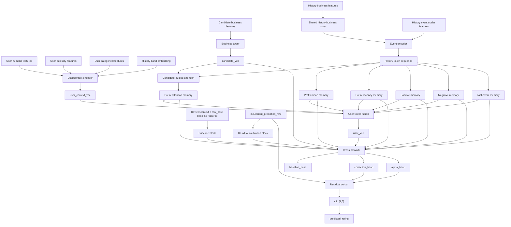

# Arquitectura Propuesta De Content-Based: Two-Tower + Cross Network + Prefix Memory

- Proposito: especificar una nueva arquitectura `known-user` para `content-based` sin asumir que los bundles deep historicos sean la base correcta.
- Tipo documental: `proposal`
- Ultima actualizacion: `2026-04-12`

## Estado De La Propuesta

Esta propuesta ya tuvo una primera implementacion y evaluacion en:

- [`known_user_two_tower_router_v2_eval_v2`](/C:/Users/mario/OneDrive/Documentos/UPM/Master_Data/Sistemas_recomendacion/recomendation-system/content-based/artifacts/known_user_two_tower_router_v2_eval_v2)

Resultado de esa primera iteracion:

- cobertura deep completa en bandas conocidas
- ninguna banda activada para router final
- el modelo empeoro el MAE frente al incumbent en `1`, `2-5`, `6-20` y `>20`

Por tanto, este documento sigue siendo una propuesta, pero ya no debe leerse como idea no probada.

Ahora representa:

- una familia arquitectonica implementada
- una primera iteracion fallida en terminos de MAE
- una base para una segunda iteracion mas conservadora si se decide continuar

## Resumen

Esta arquitectura propone reemplazar la fragmentacion actual de usuarios conocidos:

- `known_model`
- `known_prefix_deep_model`
- parte del rol conceptual de `known_user_deep_e2e`

por una sola rama profunda para `known users` basada en:

1. `business_tower`
2. `user_tower` con `prefix memory`
3. `cross network`
4. salida residual sobre `incumbent_prediction_raw`

La politica de enrutado prevista para la primera iteracion es:

- `history_band = 0` -> mantener `cold_model`
- `history_band in {1, 2-5, 6-20, >20}` -> evaluar la nueva rama `two_tower_cross_prefix_model`
- si la rama nueva no tiene cobertura o no mejora en validacion -> fallback al incumbent

La arquitectura no da por hecho que:

- `competition_embeddings_v3_iter03`
- `competition_embeddings_v3_iter04`

sean la fuente correcta de representacion de negocio.

En su lugar, define una interfaz comun para comparar varias fuentes de negocio:

- encoder estructurado desde metadata segura
- encoder preentrenado desde cero
- bundles deep heredados como simple baseline enchufable

## Objetivo Arquitectonico

El cuello de botella documentado hoy sigue concentrado en:

- `history_band = 1`
- `history_band = 2-5`

La nueva arquitectura se diseña para:

- retener la robustez del `raw_core`
- usar mejor el prefijo corto del usuario
- condicionar la representacion del usuario por el candidato
- aprender correcciones prudentes sobre el incumbent en lugar de sustituirlo sin ancla

## Diagrama General



## Ambito

### Lo Que Cubre

- usuarios conocidos
- aprendizaje de residual sobre `incumbent_prediction_raw`
- uso conjunto de:
  - metadata estructurada
  - contexto de review
  - prefijo temporal del usuario
  - interacciones usuario-candidato

### Lo Que No Cubre En V1

- sustitucion del `cold_model`
- uso obligatorio de un bundle deep historico
- grafo global usuario-negocio
- una submission unificada sin router

## Bloques Principales

## 1. Business Tower

La `business_tower` produce la representacion del negocio candidato y de los negocios del historial.

### Fuentes De Entrada Permitidas

La arquitectura debe soportar una de estas fuentes por run:

- `structured_from_scratch`
- `pretrained_structured`
- `bundle_iter03`
- `bundle_iter04`

### Opcion Recomendada De Base

`structured_from_scratch`

con metadata segura del negocio:

- `business_stars`
- `business_review_count_log1p`
- `business_rating_per_review`
- `business_is_open`
- `business_categories_count`
- `business_attributes_count`
- `business_attribute_true_count`
- `business_attribute_false_count`
- `business_attribute_string_count`
- `business_weekly_open_minutes`
- `business_open_days_count`
- `business_weekend_days_open`
- `business_late_night_days`
- `business_latitude`
- `business_longitude`
- `business_geo_abs`
- categoricas de localizacion
- categorias y atributos codificados como bloque estructurado

### Output Del Bloque

- `candidate_vec`
- `history_business_vecs`

## 2. Event Encoder

Cada evento historico combina:

- representacion del negocio historico
- escalares del evento

Escalares previstos:

- `rating`
- `rating_centered_user`
- `rating_centered_global`
- `liked_flag`
- `disliked_flag`
- `rating_abs_dev_user`
- `days_since_interaction`
- `log1p_days_since_interaction`
- `exp_decay_days_since_interaction`

### Output Del Bloque

- `history_token_sequence`

con forma logica:

- `[batch, max_history_len, hidden_dim]`

## 3. Prefix Memory

El historial no se colapsa en un solo vector demasiado pronto.

Se mantienen varias memorias simultaneas:

- `prefix_mean_memory`
- `prefix_recency_memory`
- `prefix_attention_memory`
- `positive_memory`
- `negative_memory`
- `last_event_memory`

### Intencion De Cada Memoria

- `prefix_mean_memory`: gusto medio estable
- `prefix_recency_memory`: sesgo hacia interacciones recientes
- `prefix_attention_memory`: resumen condicionado por el candidato
- `positive_memory`: preferencias afirmativas
- `negative_memory`: rechazo o aversion
- `last_event_memory`: dependencia de la ultima interaccion observada

## 4. User Tower

La `user_tower` fusiona memoria del prefijo con metadata y contexto del usuario.

### Inputs De Usuario

Bloque numerico previsto:

- `user_average_stars`
- `user_review_count`
- `user_review_count_log1p`
- `user_total_votes`
- `user_total_votes_log1p`
- `user_engagement_log1p`
- `user_friends_count`
- `user_friends_log1p`
- `user_fans`
- `user_tenure_days`
- `user_tenure_years`
- `user_elite_years_count`
- `user_elite_any`
- `user_compliment_total`
- `user_compliment_log1p_total`
- `user_compliment_nonzero_count`
- `user_metadata_completeness`
- `user_metadata_sparse_flag`
- `history_count`
- `history_count_log1p`

Bloque auxiliar previsto:

- `history_rating_mean`
- `history_rating_std`
- `history_rating_min`
- `history_rating_max`
- `history_last_rating`
- `history_positive_share`
- `history_negative_share`
- `history_recency_days_mean`

Bloque categorico previsto:

- `user_archetype_id`
- `user_activity_bucket`
- `user_reputation_bucket`
- `user_tenure_bucket`
- `history_band`

### Output Del Bloque

- `user_context_vec`
- `user_vec`

## 5. Baseline Block

La arquitectura conserva explicitamente las senales tabulares que el repo ya ha documentado como fuertes en `raw_core`.

### Inputs Previos

- `user_average_stars`
- `business_stars`
- `user_minus_global_mean`
- `business_minus_global_mean`
- `user_business_metadata_gap`
- `user_review_count_log1p`
- `business_review_count_log1p`
- `user_review_count_x_business_review_count`
- `review_total_votes`
- `review_useful`
- `review_funny`
- `review_cool`
- `review_days_since_train_start`
- `review_days_since_train_end`

Este bloque no intenta competir con el trunk profundo.

Su rol es:

- estabilizar el modelo
- preservar senal tabular fuerte
- servir de apoyo al `cross network`

## 6. Cross Network

El `cross network` combina:

- `user_vec`
- `candidate_vec`
- memorias del prefijo
- bloque baseline fuerte
- `incumbent_prediction_raw`
- similitudes usuario-candidato

### Features Derivadas Previstas

- `abs(user_vec - candidate_vec)`
- `user_vec * candidate_vec`
- `similarity_max`
- `similarity_mean`
- `last_item_similarity`
- `last_item_l2`
- cosine / dot / l2 entre `candidate_vec` y:
  - `prefix_mean_memory`
  - `prefix_recency_memory`
  - `prefix_attention_memory`
  - `positive_memory`
  - `negative_memory`

### Output Del Bloque

- `cross_features`

## 7. Heads De Salida

Heads previstas:

- `baseline_head`
- `correction_head`
- `alpha_head`

Opcionalmente:

- `uncertainty_head`

### Prediccion Final

La salida principal se define como:

```text
predicted_rating = clip(
    incumbent_prediction_raw + alpha * tanh(correction_hat),
    1,
    5
)
```

Donde:

- `correction_hat` es la correccion propuesta por la rama nueva
- `alpha` regula la intensidad de la correccion
- el clipping protege contra sobrecorrecciones fuera del rango de rating

## Especificacion De Inputs

## Vista Logica De Entrada

La arquitectura consume una fila objetivo y su contexto de usuario conocido.

### 1. Candidate Business Features

Tipo:

- vector denso de negocio

Origen posible:

- metadata estructurada segura del negocio
- encoder preentrenado de negocio
- bundle deep heredado usado como baseline

Uso:

- construir `candidate_vec`

### 2. History Business Features

Tipo:

- secuencia densa de negocios historicos

Forma logica:

- `[max_history_len, business_input_dim]`

Uso:

- construir `history_business_vecs`

### 3. History Event Scalar Features

Tipo:

- secuencia de escalares por interaccion previa

Forma logica:

- `[max_history_len, event_scalar_dim]`

Contenido previsto:

- rating previo
- rating centrado
- flags de gusto / disgusto
- recencia

### 4. User Numeric Features

Tipo:

- vector denso numerico

Contenido:

- actividad
- reputacion
- tenure
- engagement
- resumenes robustos del historial

### 5. User Auxiliary Features

Tipo:

- vector denso auxiliar

Contenido:

- estadisticos del prefijo
- completitud de metadata
- dispersion de ratings

### 6. User Categorical Features

Tipo:

- ids categoricos embebidos

Contenido:

- arquetipo de usuario
- buckets de actividad, reputacion y tenure
- `history_band`

### 7. Review Context Features

La red si recibe metadatos de la review objetivo disponibles en la fila, como bloque contextual tabular.

Contenido previsto:

- `review_useful`
- `review_funny`
- `review_cool`
- `review_total_votes`
- `review_useful_log1p`
- `review_funny_log1p`
- `review_cool_log1p`
- `review_year`
- `review_month`
- `review_weekday`
- `review_hour`
- `review_weekend_flag`
- `review_evening_flag`
- `review_days_since_train_start`
- `review_days_since_train_end`

No incluye:

- texto libre de la review
- identificadores directos
- agregados leakage-prone del target

### 8. Incumbent Input

Tipo:

- escalar

Contenido:

- `incumbent_prediction_raw`

Uso:

- ancla de la correccion residual

## Especificacion De Outputs

## Output Primario

- `predicted_rating`

Tipo:

- escalar continuo clippeado a `[1, 5]`

Uso:

- prediccion final servible por la rama known-user

## Outputs Auxiliares

- `correction_hat`
- `alpha`
- `baseline_hat`

Opcionales:

- `uncertainty_score`
- `user_vec`
- `candidate_vec`
- `memory diagnostics`

### Diagnosticos Recomendados En Validacion

- `% improved_vs_incumbent`
- `% worse_vs_incumbent`
- `mean_abs_correction`
- `alpha_mean`
- metricas por `history_band`
- cobertura efectiva de la rama nueva

## Contrato De Entrenamiento

La primera version debe mantenerse como:

- residual model para usuarios conocidos
- con `cold_model` separado
- con pesos mayores en:
  - `1`
  - `2-5`

### Objetivo Principal

- `L1` o `SmoothL1` sobre `predicted_rating`

### Objetivos Auxiliares

- perdida pequena para `baseline_hat`
- regularizacion sobre magnitud de correccion
- calibracion prudente de `alpha`

## Politica De Routing Prevista

En la primera iteracion:

- `history_band = 0` -> `cold_model`
- `history_band in {1, 2-5, 6-20, >20}`:
  - calcular prediccion incumbent
  - intentar prediccion de `two_tower_cross_prefix_model`
  - usar fallback a incumbent si:
    - no hay cobertura de features
    - la rama no esta activada para esa banda

## Criterio De Promocion

La arquitectura solo debe promoverse si:

- mejora `validation_mae_rounded` global frente al incumbent
- mejora claramente `2-5`
- no introduce una tasa alta de sobrecorrecciones

No basta con mejorar solo:

- `6-20`

si el beneficio global sigue siendo marginal.

## Experimentos Minimos Recomendados

Comparar al menos estas variantes:

1. `structured_from_scratch` sin `cross network`
2. `structured_from_scratch` con `cross network`
3. `structured_from_scratch` con `cross network` y `prefix memory` completa
4. `pretrained_structured` con arquitectura completa
5. `bundle_iter03` con arquitectura completa
6. `bundle_iter04` con arquitectura completa

## Estado

Estado actual de esta arquitectura:

- `proposed`
- no implementada
- sin snapshot oficial

Su rol hoy es:

- servir como especificacion de la siguiente linea arquitectonica a construir
- evitar que la siguiente iteracion dependa conceptualmente de bundles deep heredados como verdad del sistema
