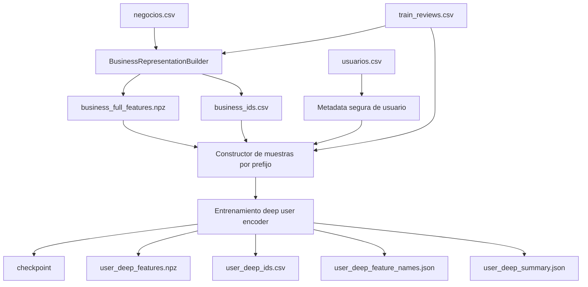
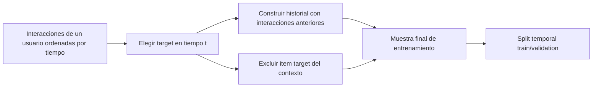

# Anexo tecnico: flujo de datos para `user_deep_embeddings`

> Documento legacy. La version canónica del flujo y del contrato de artefactos vive en:
> - [docs/flows/content-based-pipeline.md](/C:/Users/mario/OneDrive/Documentos/UPM/Master_Data/Sistemas_recomendacion/recomendation-system/docs/flows/content-based-pipeline.md)
> - [docs/reference/content-based-artifacts.md](/C:/Users/mario/OneDrive/Documentos/UPM/Master_Data/Sistemas_recomendacion/recomendation-system/docs/reference/content-based-artifacts.md)

Este documento fija el flujo de datos del encoder profundo de usuario tal y como ya esta implementado en la rama content-based.
Su objetivo es evitar ambiguedades sobre:

- que entra al modelo
- como se construyen las muestras
- como se evita leakage temporal
- como se exportan los embeddings finales

Nota de estado:

- la exportacion real vive en `content-based/utils/deep_user_embeddings.py`
- la orquestacion de la corrida vive en `content-based/build_competition_embeddings.py`
- el flujo sigue siendo util como contrato para auditoria y debugging

## 1. Nombres y familias de artefactos

Para esta documentacion se usaran estas familias conceptuales:

- `business_*`: artefactos ya existentes de representacion de negocio
- `user_manual_embeddings`: familia conceptual actual basada en `profile_matrix`, `metadata_matrix` y `full_user_matrix`
- `user_deep_embeddings`: familia nueva propuesta en esta documentacion

Importante:

- `user_manual_embeddings` es un alias documental para hablar de la familia actual
- no sustituye los nombres de artefactos ya implementados
- los artefactos nuevos de la familia profunda si tendran naming propio

## 2. Entradas logicas del modelo

Cada muestra necesita cinco bloques logicos.

### 2.1 Bloque de historial

Contiene el prefijo de negocios valorados antes del target.

Campos:

- `history_business_ids`
- `history_ratings`
- `history_mask`
- `history_length`

### 2.2 Bloque de negocio candidato

Contiene el negocio cuya nota se quiere predecir.

Campos:

- `candidate_business_id`
- `candidate_business_full_vector`

### 2.3 Bloque de metadata segura de usuario

Contiene metadata ya aceptada por el pipeline actual.

Campos conceptuales:

- `tenure_days`
- `elite_years_count`
- `elite_any`
- `useful_log1p_z`
- `funny_log1p_z`
- `cool_log1p_z`
- `fans_log1p_z`
- `compliment_*_log1p_z`

### 2.4 Bloque de supervision

Campos:

- `target_rating`
- `target_timestamp`

### 2.5 Bloque de identificacion

Campos:

- `user_id`
- `candidate_business_id`
- `sample_index`

## 3. Tensores o estructuras esperadas

La implementacion puede materializar estos bloques en tensores, matrices densas o minilotes, pero el contrato logico es el siguiente:

- `history_business_matrix`: forma `[batch, max_history_len, business_full_dim]`
- `history_rating_vector`: forma `[batch, max_history_len]`
- `history_mask`: forma `[batch, max_history_len]`
- `candidate_business_matrix`: forma `[batch, business_full_dim]`
- `user_metadata_matrix`: forma `[batch, user_metadata_dim]`
- `target_rating_vector`: forma `[batch]`

Supuestos cerrados:

- `business_full_dim` coincide con la anchura de `business_full_features`
- `user_metadata_dim` coincide con las columnas seguras derivadas del builder actual de usuario
- el padding del historial no debe contribuir a la agregacion

## 4. Orden de construccion del dataset de entrenamiento

### 4.1 Fuente base

La fuente base es:

- `train_reviews.csv`
- `business_full_features`
- metadata segura derivable de `usuarios.csv`

### 4.2 Split principal

La validacion principal debe usar:

- `temporal_train_validation_split`

No se debe fijar la seleccion de muestras usando un split random como criterio principal.

### 4.3 Muestras por prefijo temporal

Cada interaccion candidata debe construirse con esta regla:

- target en tiempo `t`
- contexto del usuario formado solo por interacciones con timestamp `< t`

Eso implica que:

- el item target no aparece dentro del contexto de la propia muestra
- el contexto cambia dinamicamente segun el target
- el modelo aprende a predecir usando informacion disponible antes de la review objetivo

### 4.4 Regla para historial vacio

Si un usuario no tiene interacciones previas al target:

- `history_length = 0`
- `history_mask` todo a cero
- el embedding de usuario debe producirse via metadata segura

## 5. Tratamiento de padding, mascara e historiales cortos

### 5.1 Padding

El historial debe poder truncarse o rellenarse a un `max_history_len` fijo por batch.

Reglas cerradas:

- padding con ceros
- el padding solo existe por razones de batching
- la mascara debe impedir que el padding aporte senal

### 5.2 Mascara

La mascara distingue:

- posiciones con negocio real del historial
- posiciones de padding

La agregacion del set encoder debe normalizar solo sobre posiciones validas.

### 5.3 Historial corto

Casos obligatorios:

- `history_length = 0`
- `history_length = 1`
- `history_length > 1`

El pipeline debe documentar claramente que:

- los usuarios con una sola review previa son un caso frecuente
- el modelo no puede depender de tener secuencias largas

## 6. Mapeo entre ids y matrices existentes

### 6.1 Negocios

La alineacion de negocio debe respetar:

- `business_ids.csv`
- el orden fila-columna de `business_full_features.npz`

Regla:

- cada `business_id` debe mapear a una unica fila del bundle de negocio

### 6.2 Usuarios

La alineacion de usuario debe respetar:

- el `user_id` original de `train_reviews.csv`
- los `user_id` presentes en la familia actual de representacion manual

Regla:

- la exportacion de `user_deep_embeddings` debe mantener un `user_id` por fila
- el fichero `user_deep_ids.csv` debe ser la fuente de verdad del orden de filas

### 6.3 Convivencia con la familia manual

La comparacion con la familia actual debe hacerse por `user_id`, no por posicion implicita.

Eso evita errores cuando:

- la familia manual y la profunda se exportan en momentos distintos
- cambia el subconjunto de usuarios exportados
- se comparan artefactos de snapshots diferentes

## 7. Diagrama 5: artefactos y outputs

Interpretacion:

- El constructor de muestras es el puente entre los artefactos tabulares actuales y el modelo profundo.
- La metadata segura del usuario no se usa de forma cruda, sino ya transformada de forma coherente con el pipeline actual.
- El entrenamiento produce tanto pesos del modelo como una exportacion desacoplada de embeddings de usuario.
- Los ids deben persistirse siempre junto a la matriz para garantizar alineacion y comparabilidad.

## 8. Diagrama 3: flujo temporal anti-leakage

Interpretacion:

- Cada muestra se construye desde una vista temporal local del usuario.
- El target nunca debe aparecer dentro del contexto que sirve para predecirlo.
- La exclusion del item target no es opcional: forma parte del contrato anti-leakage.
- La validacion temporal se aplica ademas del control por prefijo dentro de cada muestra.

## 9. Especificacion de artefactos nuevos

Los artefactos minimos de la familia profunda son:

- `user_deep_features.npz`
  - matriz densa o sparse de embeddings finales de usuario
- `user_deep_ids.csv`
  - una fila por `user_id` en el mismo orden que la matriz exportada
- `user_deep_feature_names.json`
  - lista ordenada de nombres de columnas del embedding
- `user_deep_summary.json`
  - resumen de configuracion, dimensiones, cobertura y snapshot
- `user_deep_clean_table.parquet`
  - tabla legible de soporte para auditoria y debugging
- checkpoint del modelo
  - pesos entrenados necesarios para reproducir la exportacion

## 10. Reglas de consistencia para la futura implementacion

- No debe existir una fila en `user_deep_features` sin su `user_id` correspondiente.
- No debe exportarse un `user_id` duplicado.
- La anchura del embedding debe ser fija para todo el snapshot.
- El resumen debe declarar si el embedding fue generado:
  - con historial
  - con fallback `metadata-only`
  - con defaults por ausencia de metadata util

## 11. Relacion con otros documentos

- [RFC principal](/C:/Users/mario/OneDrive/Documentos/UPM/Master_Data/Sistemas_recomendacion/recomendation-system/docs/content-based-deep-user-embeddings-rfc.md)
- [Anexo de experimentos](/C:/Users/mario/OneDrive/Documentos/UPM/Master_Data/Sistemas_recomendacion/recomendation-system/docs/content-based-deep-user-embeddings-experiments.md)
- [Feature Guide](/C:/Users/mario/OneDrive/Documentos/UPM/Master_Data/Sistemas_recomendacion/recomendation-system/docs/content-based-features-guide.md)
