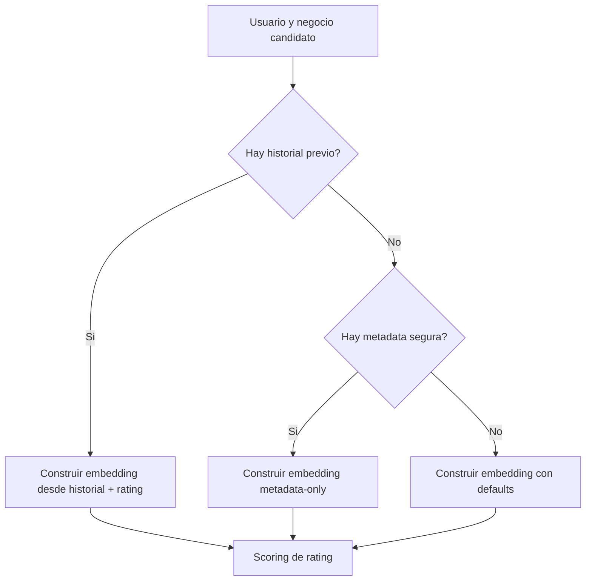

# Anexo tecnico: entrenamiento y evaluacion de `user_deep_embeddings`

> Documento legacy. La parte estable vive en:
> - [docs/training/content-based-deep-user.md](/C:/Users/mario/OneDrive/Documentos/UPM/Master_Data/Sistemas_recomendacion/recomendation-system/docs/training/content-based-deep-user.md)
>
> El historial de iteraciones vive en:
> - [docs/experiments/content-based-deep-user-log.md](/C:/Users/mario/OneDrive/Documentos/UPM/Master_Data/Sistemas_recomendacion/recomendation-system/docs/experiments/content-based-deep-user-log.md)

Este documento fija el protocolo experimental del encoder profundo de usuario ya implementado.
Su objetivo es dejar cerrados:

- la tarea de aprendizaje
- el protocolo de validacion
- los baselines obligatorios
- las ablations minimas
- los criterios de exito

Nota de estado:

- la rutina actual de entrenamiento y exportacion vive en `content-based/utils/deep_user_embeddings.py`
- la corrida de competicion que la consume vive en `content-based/build_competition_embeddings.py`
- los criterios de exito siguen siendo utiles para evaluar nuevas variantes, aunque el pipeline base ya exista

## 1. Tarea de aprendizaje

La tarea principal sera:

- regresion supervisada de rating

Cada muestra debe tener:

- contexto historico del usuario
- metadata segura del usuario
- negocio candidato
- rating objetivo

El entrenamiento del embedding no es auto-supervisado en esta v1.
El embedding se aprende porque participa en una tarea de prediccion de rating.

## 2. Objetivo de comparacion

La nueva familia `user_deep_embeddings` debe compararse contra la familia actual `user_manual_embeddings`.

En esta documentacion:

- `user_manual_embeddings` refiere al enfoque actual de representacion de usuario basado en agregacion manual de negocios valorados
- `user_deep_embeddings` refiere a la nueva familia entrenable

El objetivo no es reemplazar de inmediato el builder actual, sino medir si la familia profunda:

- iguala
- mejora
- o complementa

la familia manual actual.

## 3. Baseline actual obligatorio

Toda evaluacion debe incluir al menos un baseline con el pipeline actual.

Baseline minimo obligatorio:

- representacion actual de usuario con agregacion `centered`
- vista de negocio coherente con el experimento comparado
- scorer o regresor sencillo por encima de esa representacion

El experimento no se considerara informativo si solo informa resultados del modelo profundo sin baseline manual.

## 4. Input base fijado para la v1

La primera iteracion profunda debe usar:

- `business_full_features`

Esa decision se fija para:

- alinear la propuesta con el objetivo de prediccion de rating
- aprovechar la familia de artefactos ya validada de negocio
- no abrir una segunda linea de redisenar negocio mientras se aprende usuario

## 5. Validacion

### 5.1 Validacion principal

La validacion principal debe ser:

- temporal

Justificacion:

- el riesgo dominante es leakage temporal
- el modelo usa historial del usuario
- la validez del embedding depende de respetar causalidad temporal

### 5.2 Validacion secundaria

Puede existir una validacion random solo para iteracion rapida.

Pero queda fijado que:

- la validacion random no es criterio final
- los resultados clave deben reportarse sobre split temporal

## 6. Metricas

Metricas principales:

- `MAE`
- `RMSE`

Regla de prioridad:

- `MAE` es la metrica principal
- `RMSE` es diagnostica secundaria

Se recomienda reportar tambien:

- cobertura de embeddings exportados
- porcentaje de usuarios resueltos por historial
- porcentaje de usuarios resueltos por fallback `metadata-only`

## 7. Ablations minimas obligatorias

La futura implementacion debe comparar al menos estos escenarios.

### 7.1 Manual vs profundo

- `user_manual_embeddings`
- `user_deep_embeddings`

Objetivo:

- medir si el encoder aprendido aporta valor frente a la agregacion manual actual

### 7.2 Con y sin metadata

- `user_deep_embeddings` con metadata segura
- `user_deep_embeddings` sin metadata segura

Objetivo:

- medir cuanto aporta realmente el bloque de metadata frente al historial puro

### 7.3 Con y sin senal de rating

- encoder con ratings del historial
- encoder sin ratings del historial

Objetivo:

- medir si el encoder realmente aprende mejor al saber como valoro el usuario cada negocio

### 7.4 Input base fijado

La v1 debe usar:

- `business_full_features`

Si mas adelante se compara contra `business_content_features`, debe tratarse como extension posterior, no como requisito minimo de esta iteracion documental.

## 8. Analisis por segmentos recomendados

Ademas del resultado agregado, se recomienda reportar:

- usuarios con `1` review previa
- usuarios con `2-5`
- usuarios con `6-20`
- usuarios con `>20`

Razon:

- el dataset esta muy sesgado a historiales cortos
- el valor de un encoder profundo puede cambiar mucho segun la profundidad del historial

Tambien se recomienda segmentar:

- casos con historial real
- casos resueltos por fallback `metadata-only`

## 9. Criterios de exito

La propuesta se considerara exitosa si cumple simultaneamente:

- genera embeddings exportables para todos los usuarios del snapshot evaluado
- no introduce leakage temporal en la construccion de muestras
- produce checkpoints y summaries reproducibles
- mejora o empata de forma razonable el baseline manual en `MAE` temporal

La propuesta no se considerara validada si:

- solo mejora en split random
- solo funciona para usuarios con historial largo
- no puede exportar embeddings para usuarios sin historial util

## 10. Diagrama 4: protocolo de inferencia y fallback

Interpretacion:

- El protocolo de inferencia debe tener cobertura para usuarios con y sin historial.
- El camino `metadata-only` no es un parche informal, sino una parte oficial del diseno.
- Los defaults finales solo aparecen cuando tampoco hay metadata util suficiente.
- Esto es esencial para un dataset donde el cold start de usuario es una parte importante del problema.

## 11. Reporte minimo esperado por experimento

Cada corrida relevante debe reportar como minimo:

- configuracion del modelo
- split usado
- `MAE`
- `RMSE`
- numero total de usuarios exportados
- numero de usuarios con historial real
- numero de usuarios `metadata-only`
- referencia explicita al baseline manual comparado

## 12. Riesgos experimentales a vigilar

### 12.1 Sobreajuste

Puede aparecer si:

- el scorer final es muy flexible
- el historial del usuario memoriza patrones muy especificos
- no se respeta regularizacion suficiente

### 12.2 Ganancias aparentes por leakage

Puede aparecer si:

- el target entra en el historial por error
- el split temporal se ignora
- se usan artefactos de negocio o usuario generados con informacion posterior

### 12.3 Ventaja espuria por priors

Puede aparecer si la mejora frente al baseline manual proviene en realidad de:

- explotar priors mas que aprender mejor el usuario

Por eso el baseline manual debe compararse de forma justa y con la misma familia de inputs cuando sea posible.

## 13. Relacion con otros documentos

- [RFC principal](/C:/Users/mario/OneDrive/Documentos/UPM/Master_Data/Sistemas_recomendacion/recomendation-system/docs/content-based-deep-user-embeddings-rfc.md)
- [Anexo de flujo de datos](/C:/Users/mario/OneDrive/Documentos/UPM/Master_Data/Sistemas_recomendacion/recomendation-system/docs/content-based-deep-user-embeddings-dataflow.md)
- [Content-Based README](/C:/Users/mario/OneDrive/Documentos/UPM/Master_Data/Sistemas_recomendacion/recomendation-system/content-based/README.md)

## 14. Iterative search log (2026-04-10)

This section records the first full iterative loop run on GPU with the current codebase, the updated report, and the current business/manual pipelines.

Selection criteria used for this loop:

- primary criterion for exported embeddings: `utility_post_export_diagnostics.csv`
- secondary guardrail: honest temporal `MAE` from `user_deep_summary.json`
- tie-breakers: `pairwise_auc`, `MAE` by history band, coverage, and embedding health

Historical reference bundle already present in the repo:

- `competition_embeddings_v1`
- honest deep `MAE`: `0.9269`
- post-export deep `MAE`: `1.0386`
- post-export pairwise `AUC`: `0.7708`

### 14.1 Iteration summary

| Version | Main idea | Honest deep MAE | Post-export deep MAE | Pairwise AUC | Verdict |
| --- | --- | ---: | ---: | ---: | --- |
| `competition_embeddings_v3_iter01` | Bigger model, larger embedding, lower history shrinkage, stronger rating modulation | `0.9429` | `1.0535` | `0.6821` | Rejected |
| `competition_embeddings_v3_iter02` | Simpler `v1`-like model with milder short-history bias | `0.9805` | `0.7840` | `0.7745` | Strong export space, weak training head |
| `competition_embeddings_v3_iter03` | Conservative `v1`-like model under the new code with default shrinkage/modulation | `0.9720` | `0.7638` | `0.7751` | Best exported embeddings |
| `competition_embeddings_v3_iter04` | Current official default of the new architecture | `0.9295` | `0.8489` | `0.7274` | Best honest MAE among the new runs |

### 14.2 Iteration detail

#### `competition_embeddings_v3_iter01`

Config highlights:

- `embedding_dim=192`
- `business_hidden_layers=(768,512,384)`
- `batch_size=512`
- `learning_rate=6e-4`
- `dropout=0.12`
- `history_shrinkage_temperature=1.75`
- `rating_modulation_scale=0.5`

Observed result:

- richer geometry and better cluster separation than the old bundle
- worse honest temporal `MAE` than `v1`
- worse post-export `MAE` and much worse `AUC`

Interpretation:

- giving too much weight to short histories plus extra capacity hurt preference ordering
- the model became easier to cluster, but not more useful for the task

Next change chosen after this run:

- reduce capacity
- move closer to a simpler, more stable `v1`-like regime

#### `competition_embeddings_v3_iter02`

Config highlights:

- `embedding_dim=128`
- empty hidden-layer overrides, so the model falls back to its internal simple defaults
- `batch_size=1024`
- `learning_rate=9e-4`
- `dropout=0.10`
- `history_shrinkage_temperature=2.25`
- `rating_modulation_scale=0.4`

Observed result:

- honest temporal `MAE` degraded strongly
- post-export deep `MAE` improved a lot over both manual and `v1`
- `AUC` stayed healthy and close to the historical reference

Interpretation:

- the exported space was already becoming more linearly useful
- but the internal training head and the learned embedding space were not aligned enough

Next change chosen after this run:

- keep the simpler architecture
- remove the extra short-history bias and test the plain conservative setup

#### `competition_embeddings_v3_iter03`

Config highlights:

- `embedding_dim=128`
- simple default hidden stacks
- `batch_size=1024`
- `learning_rate=1e-3`
- `dropout=0.10`
- `history_shrinkage_temperature=3.0`
- `rating_modulation_scale=0.35`

Observed result:

- best exported deep space in this loop
- post-export deep `MAE`: `0.7638`
- pairwise `AUC`: `0.7751`
- strong improvement over the manual baseline in every history band:
  - `1`: `0.7175`
  - `2-5`: `0.8045`
  - `6-20`: `0.8205`
  - `>20`: `0.7746`
- honest temporal `MAE` was not the best new run, but it stayed clearly below the manual baseline diagnostic regime and still exported full coverage

Interpretation:

- for the task of generating reusable deep embeddings, this is the most useful bundle produced in the loop
- the main weakness is not coverage or geometry, but the mismatch between the internal training objective and the downstream linear utility of the exported embeddings

Next change chosen after this run:

- test the current official default architecture to see whether we could recover a better honest `MAE` without losing too much exported utility

#### `competition_embeddings_v3_iter04`

Config highlights:

- current default architecture from `build_competition_embeddings.py`
- `embedding_dim=128`
- `business_hidden_layers=(512,384,256)`
- `rating_hidden_layers=(64,32)`
- `metadata_hidden_layers=(128,64)`
- `scorer_hidden_layers=(256,128)`
- `batch_size=768`
- `learning_rate=8e-4`
- `dropout=0.15`
- `history_shrinkage_temperature=3.0`
- `rating_modulation_scale=0.35`

Observed result:

- best honest temporal `MAE` among the new runs: `0.9295`
- close to the historical `v1` reference: `0.9269`
- exported utility stayed strong but no longer beat `iter03`

Interpretation:

- the new official default is the best head-aligned training recipe in the new code
- but it is not the best exported embedding bundle for downstream scoring

### 14.3 Final recommendation from this loop

Recommended bundle for exported embeddings:

- `content-based/artifacts/competition_embeddings_v3_iter03`

Reason:

- best post-export deep `MAE`
- best pairwise `AUC` among the new runs
- strongest per-band behavior across all history ranges
- full user and business coverage

Recommended reference bundle for training-head calibration:

- `content-based/artifacts/competition_embeddings_v3_iter04`

Reason:

- strongest honest temporal `MAE` under the current code
- confirms the new architecture can still train competitively without needing the old artifact family

### 14.4 Main lesson for the next loop

The next gain probably does not come from making the embedding larger.
The evidence from this loop suggests a different bottleneck:

- exported embedding utility and honest head `MAE` are not aligned enough

So the next experimental direction should be:

- keep `iter03` as the embedding baseline
- revise the training or validation setup so it rewards export-space utility more directly
- only after that revisit wider embeddings or extra business features such as geo clusters
