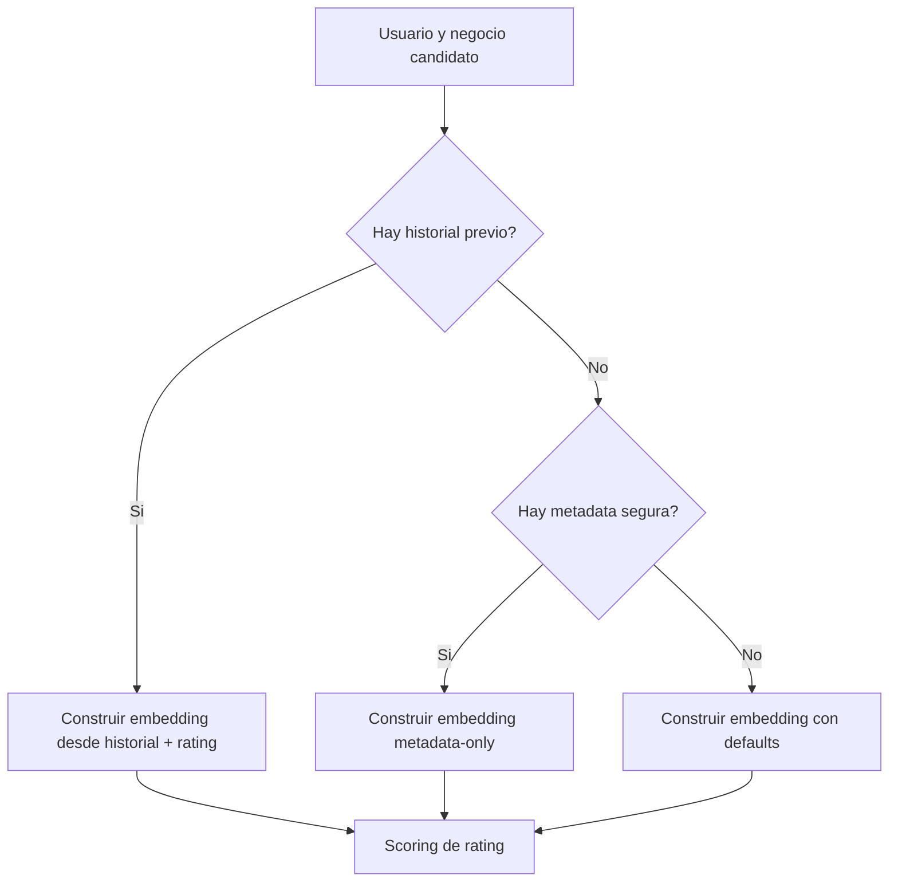

# Anexo tecnico: entrenamiento y evaluacion de `user_deep_embeddings`

Este documento fija el protocolo experimental para la futura implementacion del encoder profundo de usuario.
Su objetivo es dejar cerrados:

- la tarea de aprendizaje
- el protocolo de validacion
- los baselines obligatorios
- las ablations minimas
- los criterios de exito

## 1. Tarea de aprendizaje

La tarea principal sera:

- regresion supervisada de rating

Cada muestra debe tener:

- contexto historico del usuario
- metadata segura del usuario
- negocio candidato
- rating objetivo

El entrenamiento del embedding no es auto-supervisado en esta v1.
El embedding se aprende porque participa en una tarea de prediccion de rating.

## 2. Objetivo de comparacion

La nueva familia `user_deep_embeddings` debe compararse contra la familia actual `user_manual_embeddings`.

En esta documentacion:

- `user_manual_embeddings` refiere al enfoque actual de representacion de usuario basado en agregacion manual de negocios valorados
- `user_deep_embeddings` refiere a la nueva familia entrenable

El objetivo no es reemplazar de inmediato el builder actual, sino medir si la familia profunda:

- iguala
- mejora
- o complementa

la familia manual actual.

## 3. Baseline actual obligatorio

Toda evaluacion debe incluir al menos un baseline con el pipeline actual.

Baseline minimo obligatorio:

- representacion actual de usuario con agregacion `centered`
- vista de negocio coherente con el experimento comparado
- scorer o regresor sencillo por encima de esa representacion

El experimento no se considerara informativo si solo informa resultados del modelo profundo sin baseline manual.

## 4. Input base fijado para la v1

La primera iteracion profunda debe usar:

- `business_full_features`

Esa decision se fija para:

- alinear la propuesta con el objetivo de prediccion de rating
- aprovechar la familia de artefactos ya validada de negocio
- no abrir una segunda linea de redisenar negocio mientras se aprende usuario

## 5. Validacion

### 5.1 Validacion principal

La validacion principal debe ser:

- temporal

Justificacion:

- el riesgo dominante es leakage temporal
- el modelo usa historial del usuario
- la validez del embedding depende de respetar causalidad temporal

### 5.2 Validacion secundaria

Puede existir una validacion random solo para iteracion rapida.

Pero queda fijado que:

- la validacion random no es criterio final
- los resultados clave deben reportarse sobre split temporal

## 6. Metricas

Metricas principales:

- `MAE`
- `RMSE`

Regla de prioridad:

- `MAE` es la metrica principal
- `RMSE` es diagnostica secundaria

Se recomienda reportar tambien:

- cobertura de embeddings exportados
- porcentaje de usuarios resueltos por historial
- porcentaje de usuarios resueltos por fallback `metadata-only`

## 7. Ablations minimas obligatorias

La futura implementacion debe comparar al menos estos escenarios.

### 7.1 Manual vs profundo

- `user_manual_embeddings`
- `user_deep_embeddings`

Objetivo:

- medir si el encoder aprendido aporta valor frente a la agregacion manual actual

### 7.2 Con y sin metadata

- `user_deep_embeddings` con metadata segura
- `user_deep_embeddings` sin metadata segura

Objetivo:

- medir cuanto aporta realmente el bloque de metadata frente al historial puro

### 7.3 Con y sin senal de rating

- encoder con ratings del historial
- encoder sin ratings del historial

Objetivo:

- medir si el encoder realmente aprende mejor al saber como valoro el usuario cada negocio

### 7.4 Input base fijado

La v1 debe usar:

- `business_full_features`

Si mas adelante se compara contra `business_content_features`, debe tratarse como extension posterior, no como requisito minimo de esta iteracion documental.

## 8. Analisis por segmentos recomendados

Ademas del resultado agregado, se recomienda reportar:

- usuarios con `1` review previa
- usuarios con `2-5`
- usuarios con `6-20`
- usuarios con `>20`

Razon:

- el dataset esta muy sesgado a historiales cortos
- el valor de un encoder profundo puede cambiar mucho segun la profundidad del historial

Tambien se recomienda segmentar:

- casos con historial real
- casos resueltos por fallback `metadata-only`

## 9. Criterios de exito

La propuesta se considerara exitosa si cumple simultaneamente:

- genera embeddings exportables para todos los usuarios del snapshot evaluado
- no introduce leakage temporal en la construccion de muestras
- produce checkpoints y summaries reproducibles
- mejora o empata de forma razonable el baseline manual en `MAE` temporal

La propuesta no se considerara validada si:

- solo mejora en split random
- solo funciona para usuarios con historial largo
- no puede exportar embeddings para usuarios sin historial util

## 10. Diagrama 4: protocolo de inferencia y fallback

Interpretacion:

- El protocolo de inferencia debe tener cobertura para usuarios con y sin historial.
- El camino `metadata-only` no es un parche informal, sino una parte oficial del diseno.
- Los defaults finales solo aparecen cuando tampoco hay metadata util suficiente.
- Esto es esencial para un dataset donde el cold start de usuario es una parte importante del problema.

## 11. Reporte minimo esperado por experimento

Cada corrida relevante debe reportar como minimo:

- configuracion del modelo
- split usado
- `MAE`
- `RMSE`
- numero total de usuarios exportados
- numero de usuarios con historial real
- numero de usuarios `metadata-only`
- referencia explicita al baseline manual comparado

## 12. Riesgos experimentales a vigilar

### 12.1 Sobreajuste

Puede aparecer si:

- el scorer final es muy flexible
- el historial del usuario memoriza patrones muy especificos
- no se respeta regularizacion suficiente

### 12.2 Ganancias aparentes por leakage

Puede aparecer si:

- el target entra en el historial por error
- el split temporal se ignora
- se usan artefactos de negocio o usuario generados con informacion posterior

### 12.3 Ventaja espuria por priors

Puede aparecer si la mejora frente al baseline manual proviene en realidad de:

- explotar priors mas que aprender mejor el usuario

Por eso el baseline manual debe compararse de forma justa y con la misma familia de inputs cuando sea posible.

## 13. Relacion con otros documentos

- [RFC principal](/C:/Users/mario/OneDrive/Documentos/UPM/Master_Data/Sistemas_recomendacion/recomendation-system/docs/content-based-deep-user-embeddings-rfc.md)
- [Anexo de flujo de datos](/C:/Users/mario/OneDrive/Documentos/UPM/Master_Data/Sistemas_recomendacion/recomendation-system/docs/content-based-deep-user-embeddings-dataflow.md)
- [Content-Based README](/C:/Users/mario/OneDrive/Documentos/UPM/Master_Data/Sistemas_recomendacion/recomendation-system/content-based/README.md)
