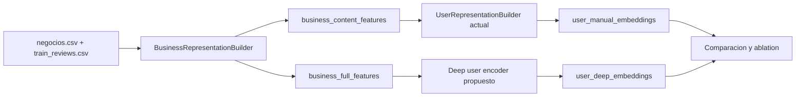
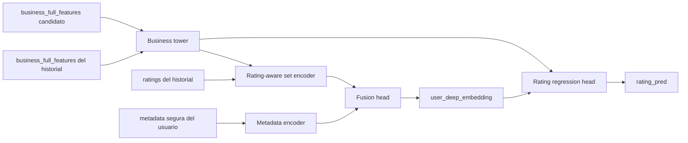
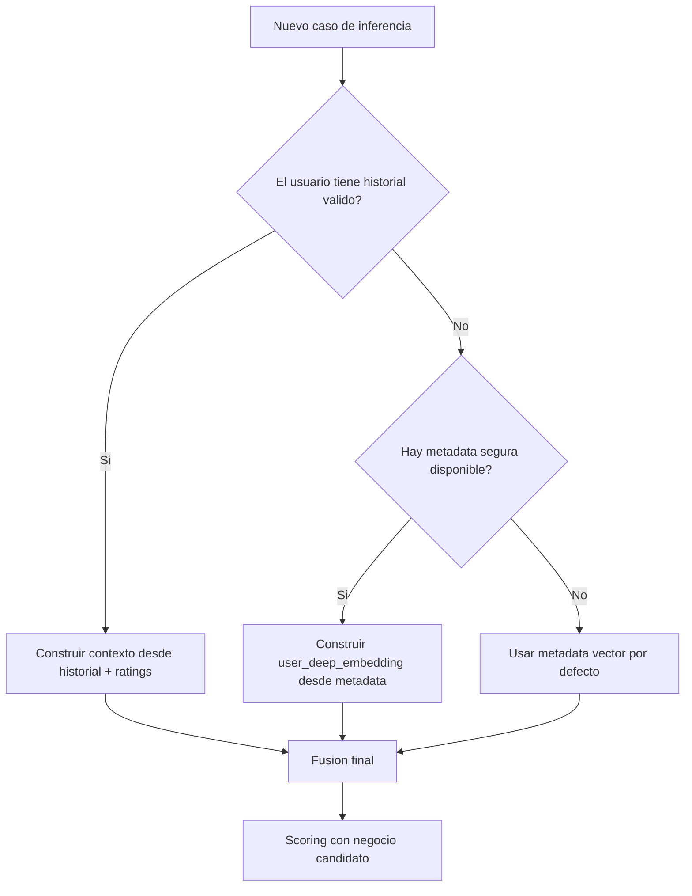
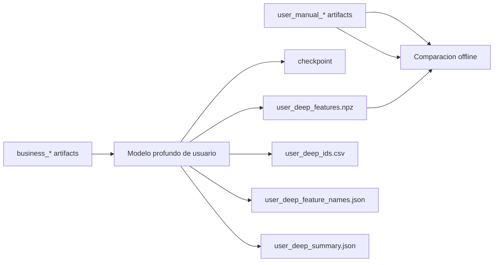

# RFC: encoder profundo de usuario para content-based

> Documento legacy. La arquitectura vigente se mantiene en:
> - [docs/architecture/content-based-current.md](/C:/Users/mario/OneDrive/Documentos/UPM/Master_Data/Sistemas_recomendacion/recomendation-system/docs/architecture/content-based-current.md)
>
> El protocolo estable de entrenamiento vive en:
> - [docs/training/content-based-deep-user.md](/C:/Users/mario/OneDrive/Documentos/UPM/Master_Data/Sistemas_recomendacion/recomendation-system/docs/training/content-based-deep-user.md)

Este documento define la arquitectura de la segunda familia de embeddings de usuario dentro de la rama [`content-based`](/C:/Users/mario/OneDrive/Documentos/UPM/Master_Data/Sistemas_recomendacion/recomendation-system/content-based).

Nota de estado:

- la arquitectura ya esta implementada en `content-based/utils/deep_user_embeddings.py`
- la corrida de competicion se hace desde `content-based/build_competition_embeddings.py`
- este documento conserva el valor de contrato de diseno y de explicacion del pipeline actual

La idea principal es mantener la representacion actual de usuario basada en agregacion manual y, en paralelo, anadir una familia nueva de embeddings aprendidos con deep learning.

Guia corta del flujo real del modelo:
- [content-based-deep-user-model-flow.md](/C:/Users/mario/OneDrive/Documentos/UPM/Master_Data/Sistemas_recomendacion/recomendation-system/docs/content-based-deep-user-model-flow.md)

Propuesta alternativa documentada de arquitectura `interaction-first`:
- [content-based-interaction-first-architecture-rfc.md](/C:/Users/mario/OneDrive/Documentos/UPM/Master_Data/Sistemas_recomendacion/recomendation-system/docs/content-based-interaction-first-architecture-rfc.md)
- [content-based-interaction-first-flow.md](/C:/Users/mario/OneDrive/Documentos/UPM/Master_Data/Sistemas_recomendacion/recomendation-system/docs/content-based-interaction-first-flow.md)

## 1. Objetivo

La rama content-based ya dispone de:

- una representacion robusta de negocio en `business_content_features`, `business_prior_features` y `business_full_features`
- una representacion manual de usuario basada en agregacion de negocios valorados
- un bloque separado de metadata segura del usuario

El objetivo de esta propuesta es anadir una nueva familia de embeddings:

- `user_manual_embeddings`: nombre conceptual para la familia actual derivada por agregacion manual
- `user_deep_embeddings`: nombre conceptual para la nueva familia aprendida con un encoder entrenable

La nueva familia debe:

- aprenderse a partir del historial de negocios valorados por el usuario
- incorporar el rating de cada interaccion para modular la agregacion
- poder enriquecerse con metadata segura del usuario
- convivir con la familia manual actual, no sustituirla de forma inmediata

## 2. Problema y motivacion

El dataset actual presenta varias propiedades que hacen atractiva esta linea:

- la representacion de negocio ya tiene buena cobertura y estructura
- el principal problema de cold start esta en usuarios nuevos
- muchos usuarios tienen historiales muy cortos
- una parte importante del test es `new_user_known_item`

Eso favorece una solucion donde:

- el negocio siga siendo el ancla semantica principal
- el embedding de usuario se aprenda a partir de negocios ya representados
- el modelo disponga de un fallback de usuario basado en metadata segura cuando el historial sea insuficiente

## 3. Por que esta v1 no sera una GNN completa

La propuesta no descarta una GNN en fases futuras, pero en esta iteracion se fija explicitamente que:

- v1 no sera una GNN bipartita completa
- v1 no hara message passing global sobre todo el grafo usuario-negocio
- v1 sera un encoder entrenable de usuario sobre entradas ya preparadas

Las razones son:

- la rama actual ya tiene una representacion de negocio validada y reusable
- una GNN completa introduce mas complejidad de muestreo, batching, memoria y debugging
- el mayor retorno inmediato parece venir de aprender mejor el embedding de usuario, no de rehacer la representacion de negocio desde cero
- el objetivo principal es habilitar comparacion limpia entre embeddings manuales y embeddings profundos

## 4. Por que usar `business_full_features`

En esta propuesta se fija como input base:

- `business_full_features`

No se parte de `business_content_features` para esta primera iteracion porque se quiere que el encoder pueda explotar:

- contenido puro del negocio
- priors recalculados desde `train_reviews.csv`

La ventaja esperada es que el encoder pueda aprender perfiles mas utiles para prediccion de rating.
El tradeoff es que:

- la interpretabilidad baja respecto a usar solo contenido
- se mezcla contenido con senal agregada observada

Ese tradeoff se acepta en esta v1 documental porque el objetivo de entrenamiento es regresion de rating, no pureza semantica.

## 5. Arquitectura propuesta

La arquitectura se divide en cinco bloques:

1. `business tower`
2. `rating-aware set encoder`
3. `metadata encoder`
4. `fusion head`
5. `rating regression head`

### 5.1 `business tower`

Su funcion es proyectar `business_full_features` a un embedding denso reutilizable.

Entrada:

- vector sparse de `business_full_features`

Salida:

- `business_dense_embedding`

Responsabilidades:

- comprimir la representacion sparse actual
- producir un espacio denso comun para items del historial y item candidato

### 5.2 `rating-aware set encoder`

Su funcion es construir el embedding del usuario a partir del conjunto de negocios valorados.

Entradas:

- embeddings densos de los negocios del historial
- rating asociado a cada review del historial
- mascara del historial valido

Decisiones cerradas:

- el historial se tratara como conjunto, no como secuencia
- el rating formara parte explicita de la senal de agregacion
- no se usara modelado temporal secuencial en esta v1

### 5.3 `metadata encoder`

Su funcion es transformar metadata segura del usuario en un bloque denso complementario.

Metadata permitida:

- `yelping_since` transformado a tenure
- `elite`
- `useful`
- `funny`
- `cool`
- `fans`
- `compliment_*`

Metadata excluida:

- `friends`
- `review_count`
- `average_stars`

### 5.4 `fusion head`

Su funcion es combinar:

- contexto derivado del historial
- contexto derivado de metadata

Salida:

- `user_deep_embedding`

### 5.5 `rating regression head`

Su funcion es entrenar el embedding de usuario de forma supervisada.

Entradas:

- `user_deep_embedding`
- embedding denso del negocio candidato
- features de interaccion usuario-item derivadas de ambos embeddings

Salida:

- prediccion de rating

## 6. Contrato conceptual de interfaces

### 6.1 Entrada del modelo

Cada muestra de entrenamiento debe incluir:

- `user_id`
- `candidate_business_id`
- historial de `business_id` previos del usuario
- ratings del historial
- mascara del historial
- metadata segura del usuario
- target de rating del negocio candidato

### 6.2 Salida del entrenamiento

El entrenamiento debe producir:

- pesos del modelo
- resumen de entrenamiento
- artefacto exportable de embeddings de usuario

### 6.3 Salida del exportador

El exportador debe producir una matriz densa de embeddings por `user_id`.

Artefactos conceptuales de salida:

- `user_deep_features.npz`
- `user_deep_ids.csv`
- `user_deep_feature_names.json`
- `user_deep_summary.json`
- checkpoint del modelo

## 7. Decisiones cerradas

Las decisiones que se consideran cerradas en esta propuesta son:

- la familia nueva se llamara conceptualmente `user_deep_embeddings`
- la familia actual se referenciara conceptualmente como `user_manual_embeddings`
- la nueva arquitectura usara `business_full_features` como entrada base
- el historial se tratara como conjunto, no como secuencia
- la supervision sera por regresion de rating
- el fallback para usuarios sin historial sera `metadata-only`
- no se reemplazara el pipeline actual de usuario en esta fase

## 8. Riesgos y tradeoffs

### 8.1 Leakage temporal

Es el riesgo principal.
Cada muestra debe construirse de forma que el contexto del usuario solo vea interacciones previas al target.

### 8.2 Usuarios con una sola review

El dataset tiene una gran proporcion de usuarios con historial minimo.
Eso obliga a:

- soportar historiales muy cortos
- disenar un fallback robusto
- no asumir que el encoder solo funcionara con historiales largos

### 8.3 Mezcla entre contenido y priors

Usar `business_full_features` mejora potencial predictivo, pero mezcla:

- contenido del negocio
- senal agregada observada en train

La documentacion experimental debe medir este tradeoff y compararlo con el baseline manual.

### 8.4 Coste computacional

La representacion actual es barata y determinista.
La propuesta profunda introduce:

- entrenamiento con PyTorch
- tuning de hiperparametros
- nuevos checkpoints
- mayor coste de exportacion y reproducibilidad

## 9. Diagrama 1: panorama actual vs propuesto

Interpretacion:

- El pipeline actual ya construye una familia de embeddings de usuario por agregacion manual.
- La propuesta nueva no rompe ese flujo, sino que anade uno nuevo en paralelo.
- El punto comun entre ambos enfoques es la representacion de negocio.
- La comparacion entre familias de embeddings pasa a ser una parte central del experimento.

## 10. Diagrama 2: arquitectura del modelo

Interpretacion:

- La `business tower` sirve como proyector compartido para historial y negocio candidato.
- El historial del usuario no se agrega por media fija, sino con un encoder sensible al rating.
- La metadata segura no sustituye al historial, sino que lo complementa.
- El embedding final de usuario se aprende porque participa directamente en la tarea de prediccion de rating.

## 11. Diagrama 3: inferencia y fallback

Interpretacion:

- El camino preferente es usar historial real del usuario.
- Si no hay historial util, la arquitectura sigue produciendo un embedding via metadata.
- Si la metadata es parcial o ausente, se usa un vector por defecto coherente con el pipeline actual.
- Eso permite que la familia `user_deep_embeddings` tenga cobertura total y no solo para usuarios abundantes.

## 12. Diagrama 4: artefactos y outputs

Interpretacion:

- Los nuevos artefactos de usuario profundo se consumen como una familia adicional de representaciones.
- Los artefactos manuales actuales siguen siendo validos y comparables.
- El checkpoint forma parte del contrato porque la exportacion de embeddings debe ser reproducible.
- La convivencia de artefactos obliga a mantener claves de alineacion estables por `user_id`.

## 13. No objetivos de esta iteracion

Quedan explicitamente fuera de esta fase documental:

- implementar una GNN completa sobre el grafo bipartito
- rehacer la representacion de negocio desde cero
- introducir `friends` como fuente principal del embedding
- decidir una arquitectura final de produccion para inferencia online

## 14. Relacion con la documentacion existente

Esta propuesta se apoya sobre:

- [Content-Based README](/C:/Users/mario/OneDrive/Documentos/UPM/Master_Data/Sistemas_recomendacion/recomendation-system/content-based/README.md)
- [Content-Based Feature Guide](/C:/Users/mario/OneDrive/Documentos/UPM/Master_Data/Sistemas_recomendacion/recomendation-system/docs/content-based-features-guide.md)
- [Project Status](/C:/Users/mario/OneDrive/Documentos/UPM/Master_Data/Sistemas_recomendacion/recomendation-system/docs/project-status.md)

Y se completa con los anexos:

- [Anexo de flujo de datos](/C:/Users/mario/OneDrive/Documentos/UPM/Master_Data/Sistemas_recomendacion/recomendation-system/docs/content-based-deep-user-embeddings-dataflow.md)
- [Anexo de entrenamiento y experimentos](/C:/Users/mario/OneDrive/Documentos/UPM/Master_Data/Sistemas_recomendacion/recomendation-system/docs/content-based-deep-user-embeddings-experiments.md)
