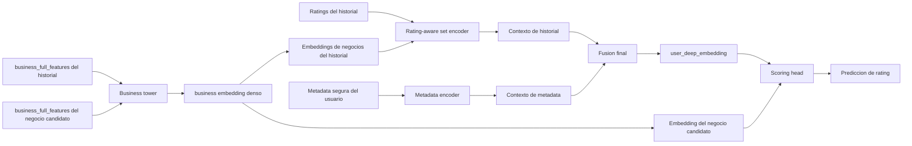
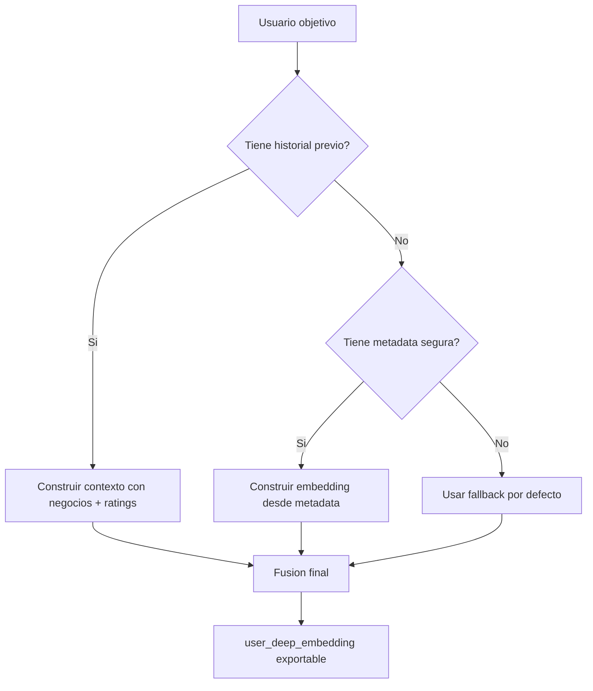

# Guia Corta Del Flujo Del Modelo Profundo De Usuario

## Objetivo

Este modelo no aprende solo embeddings de usuario. Aprende dos cosas a la vez:

- una proyeccion densa de negocio a partir de `business_full_features`
- un embedding de usuario construido desde:
  - el historial de negocios valorados
  - los ratings de ese historial
  - la metadata segura del usuario

El objetivo final del entrenamiento es predecir `rating`.

## Idea Principal

La arquitectura usa una `business tower` compartida. Esa torre transforma cada negocio desde su representacion manual completa a un embedding denso.

Ese embedding denso se reutiliza en dos sitios:

- para representar los negocios del historial del usuario
- para representar el negocio candidato cuya nota queremos predecir

Luego el modelo agrega el historial con un `rating-aware set encoder`, fusiona esa informacion con metadata del usuario y genera `user_deep_embedding`.

## Flujo End-to-End

### Como leer el diagrama

- La `business tower` es el bloque que convierte `business_full_features` en embeddings densos de negocio.
- Ese bloque es compartido: no hay una version distinta para historial y candidato.
- El `rating-aware set encoder` combina embeddings de negocios pasados con sus ratings para resumir el gusto del usuario.
- El embedding final de usuario no sale solo del historial: tambien incorpora metadata segura.
- La prediccion final de rating usa conjuntamente el embedding del usuario y el embedding del negocio candidato.

## Entradas Reales Del Modelo

### 1. Negocios

La entrada base de negocio es `business_full_features`, que incluye:

- geografia
- categorias
- atributos
- horas
- priors derivados de `train_reviews`

No se entrena desde texto crudo ni desde una GNN completa en esta version.

### 2. Historial del usuario

Para cada usuario se usan sus interacciones previas:

- negocios previamente valorados
- rating dado a cada uno

El historial se trata como conjunto, no como secuencia temporal completa. Es decir:

- importa que negocios ha valorado
- importa con que rating
- no se modela una dinamica secuencial compleja tipo RNN o Transformer temporal

### 3. Metadata segura de usuario

Se añade metadata que no mete leakage directo del target, como por ejemplo:

- `tenure_days`
- `elite_years_count`
- `elite_any`
- `fans`
- `useful`
- `funny`
- `cool`
- `compliment_*`

## Que Aprende Exactamente

### A. `business_deep_features`

Son los embeddings densos aprendidos por la `business tower`.

Interpretacion:

- cada fila corresponde a un negocio
- son una version comprimida y aprendida de `business_full_features`
- viven en el mismo espacio que usa el modelo profundo para hacer scoring

Artefacto:

- [business_deep_features.npz](/C:/Users/mario/OneDrive/Documentos/UPM/Master_Data/Sistemas_recomendacion/recomendation-system/content-based/artifacts/competition_embeddings_v1/user_deep_repr/business_deep_features.npz)

### B. `user_deep_features`

Son los embeddings finales de usuario producidos tras:

- resumir historial + ratings
- codificar metadata
- fusionar ambas partes

Interpretacion:

- cada fila corresponde a un usuario
- cuando hay historial real, el embedding refleja comportamiento observado
- cuando no hay historial, el embedding puede salir de fallback `metadata_only`

Artefacto:

- [user_deep_features.npz](/C:/Users/mario/OneDrive/Documentos/UPM/Master_Data/Sistemas_recomendacion/recomendation-system/content-based/artifacts/competition_embeddings_v1/user_deep_repr/user_deep_features.npz)

## Fallbacks

El modelo da cobertura total porque no depende solo del historial.

Casos:

- usuario con historial: embedding basado principalmente en historial + metadata
- usuario sin historial pero con metadata: embedding `metadata_only`
- usuario sin informacion util: fallback por defecto

### Como leer este fallback

- El modelo no se rompe cuando falta historial.
- El coste de ese fallback es calidad predictiva menor en cold-start.
- Por eso en analisis y competicion conviene separar `history`, `metadata_only` y `default_only`.

## Donde Se Ve Esto En El Codigo

### Modelo

- [deep_user_encoder.py](/C:/Users/mario/OneDrive/Documentos/UPM/Master_Data/Sistemas_recomendacion/recomendation-system/content-based/model/deep_user_encoder.py#L21)
- [deep_user_encoder.py](/C:/Users/mario/OneDrive/Documentos/UPM/Master_Data/Sistemas_recomendacion/recomendation-system/content-based/model/deep_user_encoder.py#L76)
- [deep_user_encoder.py](/C:/Users/mario/OneDrive/Documentos/UPM/Master_Data/Sistemas_recomendacion/recomendation-system/content-based/model/deep_user_encoder.py#L79)
- [deep_user_encoder.py](/C:/Users/mario/OneDrive/Documentos/UPM/Master_Data/Sistemas_recomendacion/recomendation-system/content-based/model/deep_user_encoder.py#L121)

### Export de embeddings

- [deep_user_embeddings.py](/C:/Users/mario/OneDrive/Documentos/UPM/Master_Data/Sistemas_recomendacion/recomendation-system/content-based/utils/deep_user_embeddings.py#L47)
- [deep_user_embeddings.py](/C:/Users/mario/OneDrive/Documentos/UPM/Master_Data/Sistemas_recomendacion/recomendation-system/content-based/utils/deep_user_embeddings.py#L79)
- [deep_user_embeddings.py](/C:/Users/mario/OneDrive/Documentos/UPM/Master_Data/Sistemas_recomendacion/recomendation-system/content-based/utils/deep_user_embeddings.py#L268)
- [deep_user_embeddings.py](/C:/Users/mario/OneDrive/Documentos/UPM/Master_Data/Sistemas_recomendacion/recomendation-system/content-based/utils/deep_user_embeddings.py#L566)

## Resumen Corto

- `business_full_features` es la entrada manual completa de negocio.
- `business_deep_features` es la proyeccion aprendida y densa de ese negocio.
- `user_deep_features` es el embedding final del usuario.
- El modelo aprende ambos espacios porque necesita representar usuario y negocio dentro del mismo sistema de scoring.
