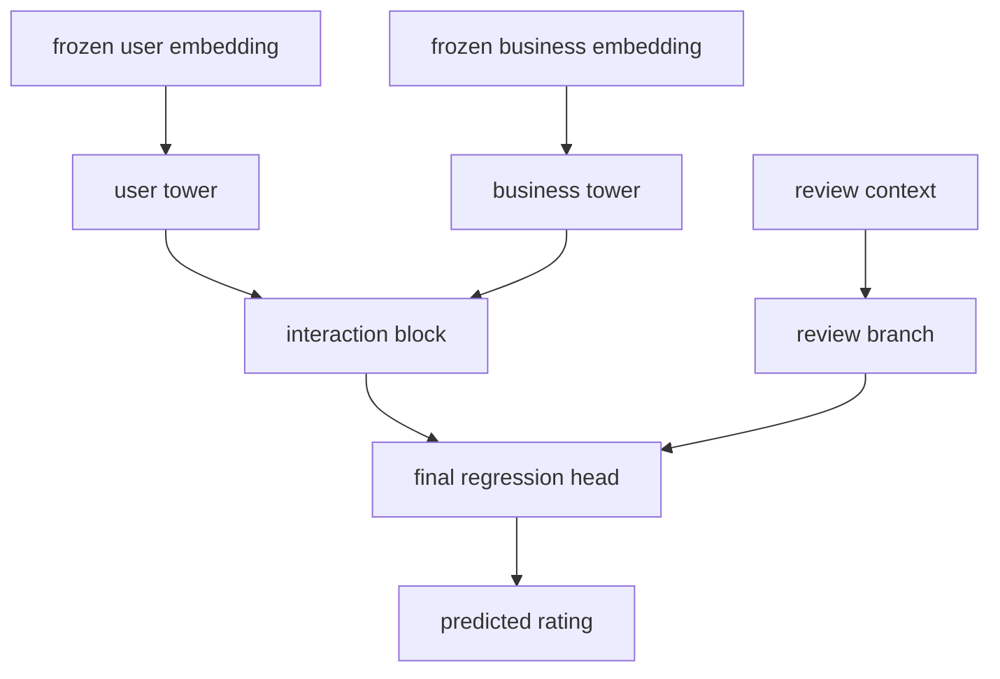

# Frozen Embedding Regressor

This document describes the downstream regressor implemented on top of frozen deep user/business embeddings.

Entry point:

- [train_frozen_embedding_regressor.py](/C:/Users/mario/OneDrive/Documentos/UPM/Master_Data/Sistemas_recomendacion/recomendation-system/content-based/train_frozen_embedding_regressor.py)

Model file:

- [frozen_embedding_regressor.py](/C:/Users/mario/OneDrive/Documentos/UPM/Master_Data/Sistemas_recomendacion/recomendation-system/content-based/model/frozen_embedding_regressor.py)

Utility layer:

- [frozen_embedding_regression.py](/C:/Users/mario/OneDrive/Documentos/UPM/Master_Data/Sistemas_recomendacion/recomendation-system/content-based/utils/frozen_embedding_regression.py)

## What the model does

The model treats exported deep embeddings as fixed inputs.

Inputs:

- frozen user embedding
- frozen business embedding
- review-context features available at inference time:
  - `useful`
  - `funny`
  - `cool`
  - `date`

## Model diagram

Architecture:

- user tower over the frozen user embedding
- business tower over the frozen business embedding
- explicit interaction block with:
  - concatenation
  - absolute difference
  - elementwise product
  - dot product
  - cosine similarity
- small review-context branch
- final regression head

Objective:

- rating regression

## Evaluation modes implemented

The training script supports two evaluation modes:

1. Diagnostic mode

- split `train_reviews.csv` temporally
- evaluate using already exported bundles
- this is fast but can be leaky if the bundle was exported from all of `train_reviews.csv`

2. Honest snapshot mode

- use `train_reviews.csv` as the training snapshot
- use `test_reviews.csv` as an explicit held-out validation set
- this is the intended mode when the embedding bundles were generated only from the training snapshot

The honest mode is enabled with:

- `--use-test-reviews-as-validation`

## Current runs

### Diagnostic run

Artifacts:

- [frozen_embedding_regressor_v1](/C:/Users/mario/OneDrive/Documentos/UPM/Master_Data/Sistemas_recomendacion/recomendation-system/content-based/artifacts/frozen_embedding_regressor_v1)

Important warning:

- this run is diagnostic only
- it uses downstream validation on a temporal split while the embedding bundles come from full-train exports
- it should not be used as the final model-selection result

### Honest run

Artifacts:

- [frozen_embedding_regressor_honest_v1](/C:/Users/mario/OneDrive/Documentos/UPM/Master_Data/Sistemas_recomendacion/recomendation-system/content-based/artifacts/frozen_embedding_regressor_honest_v1)

Honest embedding bundles used:

- [competition_embeddings_v3_iter03_honest_snapshot](/C:/Users/mario/OneDrive/Documentos/UPM/Master_Data/Sistemas_recomendacion/recomendation-system/content-based/artifacts/competition_embeddings_v3_iter03_honest_snapshot)
- [competition_embeddings_v3_iter04_honest_snapshot](/C:/Users/mario/OneDrive/Documentos/UPM/Master_Data/Sistemas_recomendacion/recomendation-system/content-based/artifacts/competition_embeddings_v3_iter04_honest_snapshot)

Validation summary:

- best overall experiment: `ridge_iter03_baseline`
- best trainable experiment: `iter04_with_review`
- ridge baseline:
  - `MAE = 1.2282`
  - `RMSE = 1.5878`
  - `pairwise_auc = 0.6499`
- best trainable model:
  - `MAE = 1.2302`
  - `RMSE = 1.8500`
  - `pairwise_auc = 0.6696`

Interpretation:

- the first frozen-MLP version does not yet beat the honest Ridge baseline on `MAE`
- it does slightly improve preference ordering (`AUC`)
- the current acceptance target is therefore not met yet

## Main takeaways from v1

- the downstream scorer architecture is now implemented end to end
- the repo can now compare frozen-embedding baselines and trainable downstream heads on the same temporal snapshot
- review-context features are now wired and saved as part of the run artifacts
- leakage matters a lot:
  - the diagnostic run looked dramatically better
  - the honest run is much harder and should be the reference

## Competition-oriented full-train artifact

For the competition workflow where the original exported bundles are intentionally reused, the repo now includes a full-train artifact:

- [frozen_embedding_submission_v1](/C:/Users/mario/OneDrive/Documentos/UPM/Master_Data/Sistemas_recomendacion/recomendation-system/content-based/artifacts/frozen_embedding_submission_v1)

This artifact was trained with:

- source experiment: `iter04_with_review`
- embedding bundle: [competition_embeddings_v3_iter04](/C:/Users/mario/OneDrive/Documentos/UPM/Master_Data/Sistemas_recomendacion/recomendation-system/content-based/artifacts/competition_embeddings_v3_iter04)
- fixed epochs on full train: `18`
- review-context branch: enabled

Competition scripts:

- [train_frozen_embedding_submission_model.py](/C:/Users/mario/OneDrive/Documentos/UPM/Master_Data/Sistemas_recomendacion/recomendation-system/content-based/train_frozen_embedding_submission_model.py)
- [predict_frozen_embedding_submission.py](/C:/Users/mario/OneDrive/Documentos/UPM/Master_Data/Sistemas_recomendacion/recomendation-system/content-based/predict_frozen_embedding_submission.py)

Competition output:

- [submission.csv](/C:/Users/mario/OneDrive/Documentos/UPM/Master_Data/Sistemas_recomendacion/recomendation-system/content-based/artifacts/frozen_embedding_submission_v1/submission.csv)

The final file contains exactly:

- `ids`
- `prediction`

Where:

- `ids = review_id`
- `prediction` is clipped to `[1, 5]` and rounded before export

## Recommended next iteration

The next likely improvements are:

- simplify or regularize the trainable head further
- test `iter04` without review-context features
- re-check whether the explicit review-context branch is helping `MAE` or only `AUC`
- consider a stronger but still controlled tabular baseline on top of the frozen embeddings before moving to end-to-end fine-tuning
