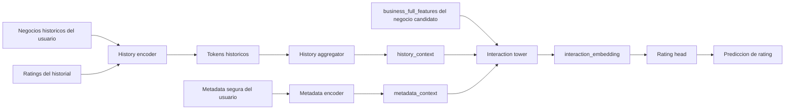

# RFC: arquitectura interaction-first para content-based

Este documento describe una nueva arquitectura propuesta para la rama [`content-based`](/C:/Users/mario/OneDrive/Documentos/UPM/Master_Data/Sistemas_recomendacion/recomendation-system/content-based), distinta del modelo profundo actualmente implementado.

La idea central es cambiar el orden del procesamiento:

- en lugar de proyectar cada negocio historico por la `business tower` y agregar despues
- primero se agrega el historial del usuario en un vector de contexto
- despues ese contexto se concatena con el negocio candidato
- y esa union alimenta una torre de interaccion condicionada por contexto

Esta propuesta esta documentada para analisis y diseno. No implica que ya exista una implementacion de codigo.

Guia corta del flujo propuesto:
- [content-based-interaction-first-flow.md](/C:/Users/mario/OneDrive/Documentos/UPM/Master_Data/Sistemas_recomendacion/recomendation-system/docs/content-based-interaction-first-flow.md)

## 1. Objetivo

El objetivo de esta arquitectura es mejorar la forma en que el modelo usa el historial del usuario para predecir el rating de un negocio candidato.

La intuicion es la siguiente:

- el modelo actual deja que el negocio candidato entre en una ruta relativamente directa hacia el `scorer`
- el historial del usuario pasa por una ruta mas larga y mas agregada
- eso puede hacer que la senal del historial quede infrautilizada o diluida

La arquitectura `interaction-first` intenta corregir eso haciendo que el contexto historico entre antes en el procesamiento del candidato.

## 2. Cambio conceptual respecto al modelo actual

### 2.1 Arquitectura actual

Orden de procesamiento actual:

1. cada negocio, historico o candidato, se proyecta por la `business tower`
2. los negocios historicos se agregan en un embedding de usuario
3. el embedding del usuario se combina con el embedding del negocio candidato
4. el `scorer` predice rating

En ese diseno:

- existe un embedding de negocio puro y exportable
- el historial se resume despues de pasar por la proyeccion de negocio
- la interaccion usuario-candidato ocurre tarde

### 2.2 Arquitectura interaction-first

Orden de procesamiento propuesto:

1. las features de los negocios historicos del usuario se agregan primero
2. esa agregacion genera un `history_context`
3. el `history_context` se concatena con las features del negocio candidato
4. una torre de interaccion procesa el par `contexto + candidato`
5. el modelo produce la prediccion de rating

En este diseno:

- la interaccion historial-candidato ocurre antes
- el contexto del usuario condiciona explicitamente el procesamiento del negocio candidato
- la arquitectura se parece mas a un modelo de matching contextual que a un simple esquema `user tower + item tower + scorer`

## 3. Motivacion

Esta propuesta tiene sentido especialmente por estas propiedades del dataset:

- muchisimos usuarios tienen historiales muy cortos
- el cold-start de usuario es un problema dominante
- el negocio candidato puede dominar facilmente la prediccion si entra por una ruta demasiado directa
- el valor del historial no esta solo en cada item por separado, sino en el patron agregado que forman juntos

La hipotesis de trabajo es:

- si agregamos primero el historial y usamos ese contexto para transformar el candidato
- el modelo puede aprender mejor la relevancia del negocio candidato para ese usuario concreto

## 4. Principio de diseno

La nueva arquitectura se inspira en dos ideas:

- agregacion contextual del historial
- actualizacion condicionada del candidato

No es una GNN completa sobre todo el grafo usuario-negocio.
Pero si es una arquitectura mas cercana a una GNN local o a un bloque de message passing restringido al ego-grafo del usuario:

- nodo central: usuario
- vecinos: negocios historicos
- mensaje agregado: contexto del historial
- actualizacion: el negocio candidato se procesa condicionado por ese mensaje

## 5. Arquitectura propuesta

La arquitectura se divide en cinco bloques:

1. `history encoder`
2. `history aggregator`
3. `metadata encoder`
4. `interaction tower`
5. `rating head`

### 5.1 `history encoder`

Su funcion es transformar cada negocio historico del usuario antes de agregarlo.

Entrada:

- `business_full_features` de cada negocio del historial
- rating asociado a cada negocio del historial

Salida:

- tokens historicos enriquecidos

Decision cerrada:

- los negocios historicos no se proyectan de forma aislada hacia un embedding exportable de negocio
- se codifican como parte del proceso de construccion del contexto del usuario

### 5.2 `history aggregator`

Su funcion es construir un `history_context` unico por usuario para la muestra actual.

Entrada:

- tokens historicos enriquecidos
- mascara del historial valido

Salida:

- `history_context`

Decision cerrada:

- el historial se tratara como conjunto
- el rating se incorporara explicitamente en la agregacion
- no se modelara una secuencia temporal completa en esta version documental

### 5.3 `metadata encoder`

Su funcion es aportar contexto adicional estable del usuario.

Metadata permitida:

- `tenure_days`
- `elite_years_count`
- `elite_any`
- `useful`
- `funny`
- `cool`
- `fans`
- `compliment_*`

Metadata excluida:

- `friends`
- `review_count`
- `average_stars`

Salida:

- `metadata_context`

### 5.4 `interaction tower`

Es el bloque mas importante de esta propuesta.

Su funcion es procesar conjuntamente:

- `history_context`
- `metadata_context`
- `business_full_features` del negocio candidato

Entrada conceptual:

- `concat(history_context, metadata_context, candidate_business_features)`

Salida conceptual:

- `interaction_embedding`

Importante:

- en esta arquitectura, este bloque ya no debe entenderse como una `business tower` pura
- aunque reuse internamente capas similares a una torre de negocio, conceptualmente es una torre de interaccion condicionada por usuario

### 5.5 `rating head`

Su funcion es mapear la salida de la `interaction tower` a una prediccion de rating.

Entrada:

- `interaction_embedding`

Salida:

- rating predicho

## 6. Flujo completo de la muestra

Cada muestra de entrenamiento contiene:

- `user_id`
- `candidate_business_id`
- negocios historicos del usuario
- ratings del historial
- metadata segura del usuario
- rating target del candidato

Flujo:

1. se codifican los negocios historicos junto con sus ratings
2. se agregan en un `history_context`
3. se codifica la metadata del usuario
4. se concatena `history_context + metadata_context + candidate_business_features`
5. la `interaction tower` produce una representacion contextualizada
6. el `rating head` genera la prediccion

## 7. Diagrama de arquitectura

### Como leer este diagrama

- El historial del usuario se resume primero.
- El negocio candidato no se proyecta de forma totalmente independiente.
- La informacion del usuario condiciona el procesamiento del candidato antes de la prediccion final.
- La unidad semantica principal ya no es un embedding de negocio puro, sino una representacion contextualizada usuario-candidato.

## 8. Diferencia con una GNN completa

Esta arquitectura no es una GNN global porque:

- no hace message passing sobre todos los usuarios y negocios a la vez
- no propaga mensajes multi-hop sobre todo el grafo
- no necesita sampling de vecinos globales ni batching de subgrafos grandes

Pero si comparte una intuicion con una GNN:

- el historial del usuario actua como vecindario local
- ese vecindario se agrega
- la representacion del candidato se actualiza con ese mensaje agregado

Por eso puede describirse como:

- `GNN-inspired`
- `local message passing`
- `interaction-first candidate-conditioned encoder`

## 9. Que se gana con este cambio

### 9.1 Ventajas esperadas

- la senal del historial entra antes en el modelo
- el negocio candidato se interpreta en funcion del contexto del usuario
- puede reducirse la dominancia de la rama directa del item candidato
- la prediccion puede capturar mejor relevancia contextual

### 9.2 Casos donde deberia ayudar mas

- usuarios con historial corto pero no vacio
- candidatos ambiguos que cambian mucho segun el contexto del usuario
- escenarios donde importa mas el matching contextual que la similitud item-item pura

## 10. Que se pierde o complica

### 10.1 Perdida de embedding de negocio puro

En esta arquitectura no existe de forma natural un `business_deep_features` standalone equivalente al actual.

Eso implica:

- menos reutilizacion del espacio de negocio como artefacto independiente
- menos facilidad para hacer vecinos de negocio en un espacio profundo puro
- menor interpretabilidad del bloque de negocio como representacion exportable

### 10.2 Menor modularidad

La arquitectura queda mas centrada en la tarea de rating concreta.

Eso es bueno para prediccion, pero peor si se quiere:

- exportar embeddings de negocio reutilizables
- separar nitidamente torre de usuario y torre de negocio
- reutilizar el embedding de negocio en otras tareas

### 10.3 Riesgo de sobreajuste contextual

Si el modelo contextualiza demasiado pronto:

- puede perder estructura global de negocio
- puede volverse menos robusto en cold-start duro
- puede capturar patrones espurios muy ligados al entrenamiento

## 11. Artefactos esperados bajo esta arquitectura

La familia principal de artefactos pasaria a ser:

- `user_interaction_features.npz` o nombre equivalente
- `user_ids.csv`
- `interaction_model_checkpoint.pt`
- `training_summary.json`

Decision importante:

- no se asume como salida obligatoria un `business_deep_features.npz` standalone

Si se quisiera conservar algo parecido a eso, habria que anadir una segunda ruta auxiliar, pero eso ya seria otra variante arquitectonica.

## 12. Decisiones cerradas para esta propuesta documental

- esta propuesta describe una arquitectura nueva, no una pequena variacion de la actual
- el historial se agrega antes del bloque principal de interaccion con el candidato
- el negocio candidato entra junto con el contexto de usuario a una torre de interaccion
- la supervision sigue siendo regresion de rating
- la metadata segura del usuario sigue estando permitida
- la salida principal del modelo es una prediccion contextualizada usuario-candidato
- no se presupone un embedding de negocio puro exportable como artefacto principal

## 13. Riesgos y tradeoffs

### 13.1 El modelo puede mejorar prediccion pero empeorar reutilizacion

Esta arquitectura esta mas optimizada para scoring que para representacion reusable.

### 13.2 El beneficio puede ser pequeno en usuarios sin historial

Si no hay historial:

- la arquitectura sigue dependiendo mucho de metadata
- no resuelve por si sola el cold-start extremo

### 13.3 Puede ser mas dificil de comparar con el pipeline actual

El modelo actual separa con claridad:

- embedding de negocio
- embedding de usuario
- scorer

Esta propuesta mezcla mas esas fronteras.

## 14. Recomendacion de lectura

Esta arquitectura debe entenderse como una propuesta orientada a:

- mejorar el uso del historial
- hacer la interaccion usuario-candidato mas temprana
- acercarse a una idea tipo GNN local sin construir una GNN global completa

No debe entenderse como un reemplazo trivial de la arquitectura actual.
Es un rediseño conceptual del flujo principal del modelo.

## 15. Resumen corto

- el historial se agrega primero
- ese contexto se concatena con el negocio candidato
- el bloque central ya no es una `business tower` pura, sino una `interaction tower`
- la arquitectura puede mejorar matching contextual
- la principal renuncia es perder un embedding de negocio profundo puro y reutilizable
