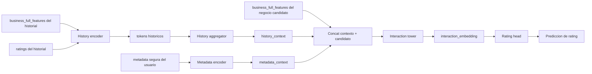
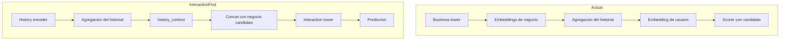

# Guia Corta Del Flujo De La Arquitectura Interaction-First

> Documento legacy. La propuesta canónica actual vive en:
> - [docs/proposals/content-based-interaction-first.md](/C:/Users/mario/OneDrive/Documentos/UPM/Master_Data/Sistemas_recomendacion/recomendation-system/docs/proposals/content-based-interaction-first.md)

## Idea principal

La propuesta `interaction-first` cambia una idea clave del modelo actual:

- el historial del usuario se agrega antes
- el negocio candidato se procesa condicionado por ese contexto

No se parte de:

- `business -> embedding puro`
- `user -> embedding puro`
- `scorer final`

Sino de:

- `historial -> contexto`
- `contexto + candidato -> torre de interaccion`
- `torre de interaccion -> rating`

## Flujo end-to-end

### Como leer el diagrama

- Los negocios historicos no producen primero un embedding de negocio exportable.
- Primero se transforman y agregan en un `history_context`.
- Ese contexto condiciona el tratamiento del negocio candidato.
- La prediccion final se apoya en una representacion contextualizada del par usuario-candidato.

## Diferencia visual con la arquitectura actual

### Como leer esta comparacion

- En el modelo actual, el embedding de negocio aparece muy pronto y luego se reutiliza.
- En `interaction-first`, el historial se resume antes y el negocio candidato entra ya condicionado por el usuario.
- El modelo actual separa mejor representacion y scoring.
- La propuesta nueva integra mas ambas cosas.

## Que cambia en los artefactos

En el modelo actual es natural exportar:

- `business_deep_features`
- `user_deep_features`

En la arquitectura `interaction-first`, el artefacto natural seria:

- una representacion contextualizada de interaccion
- o directamente un modelo de scoring entrenado

Por eso esta arquitectura:

- mejora potencialmente la parte de matching
- pero empeora la idea de un embedding puro de negocio reutilizable

## Cuando tiene sentido

Esta propuesta tiene mas sentido si el objetivo principal es:

- maximizar calidad de prediccion
- reforzar el papel del historial del usuario
- hacer que el candidato no domine la prediccion de forma demasiado directa

Tiene menos sentido si el objetivo principal es:

- tener un espacio de negocio exportable
- hacer retrieval negocio-negocio con el embedding profundo
- mantener torres de usuario y negocio claramente separadas

## Resumen corto

- primero se agrega el historial
- luego se condiciona el candidato con ese contexto
- la torre central deja de ser una `business tower` pura
- el modelo pasa a estar mas orientado a interaccion que a representacion reusable
