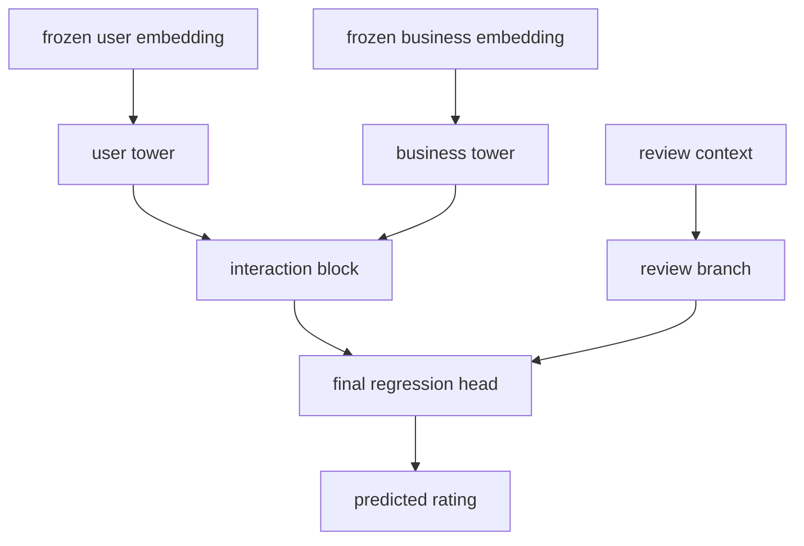
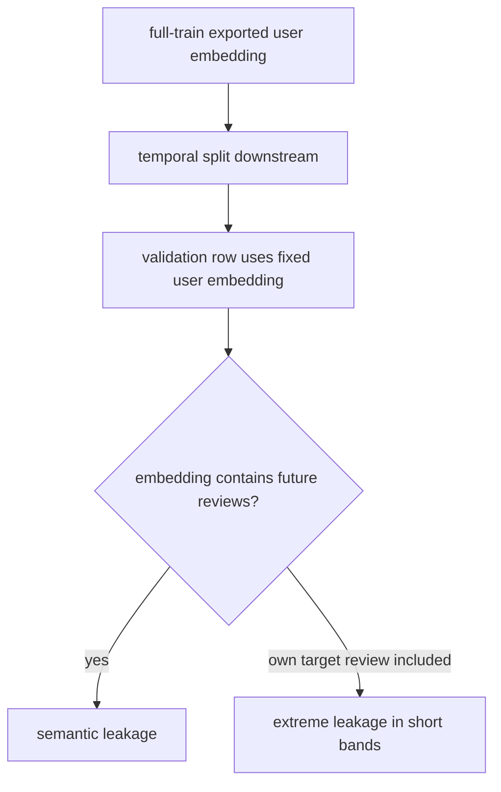

# Frozen Embedding Regressor Leak Audit

Fecha: `2026-04-10`

## Estructura Del Modelo Auditado

## Riesgo Auditado

## Hallazgo principal

La anomalia extrema del `frozen_embedding_regressor_v1` no viene de un embedding numericamente corrupto. Viene de usar un embedding de usuario estatico, exportado con historia completa de `train_reviews.csv`, para evaluar despues sobre una validacion temporal extraida de ese mismo `train_reviews.csv`.

En esa situacion, el embedding del usuario ve interacciones futuras respecto a la fila validada. En muchisimos casos ve incluso la propia review objetivo.

## Prueba

### 1. El bundle exportado usa historia completa

En [`deep_user_embeddings.py`](/C:/Users/mario/OneDrive/Documentos/UPM/Master_Data/Sistemas_recomendacion/recomendation-system/content-based/utils/deep_user_embeddings.py#L240) se reentrena el modelo final sobre todas las interacciones disponibles en `train_reviews.csv`.

Despues, en [`deep_user_embeddings.py`](/C:/Users/mario/OneDrive/Documentos/UPM/Master_Data/Sistemas_recomendacion/recomendation-system/content-based/utils/deep_user_embeddings.py#L256), los embeddings exportados se construyen con:

- `export_histories = _build_export_history_arrays(..., interactions=interactions, ...)`

Y en [`deep_user_embeddings.py`](/C:/Users/mario/OneDrive/Documentos/UPM/Master_Data/Sistemas_recomendacion/recomendation-system/content-based/utils/deep_user_embeddings.py#L781) se ve que `_build_export_history_arrays` usa directamente esas `interactions` completas para rellenar `history_item_idx`, `history_ratings` y `history_count`.

### 2. El downstream vuelve a partir temporalmente `train_reviews.csv`

En [`train_frozen_embedding_regressor.py`](/C:/Users/mario/OneDrive/Documentos/UPM/Master_Data/Sistemas_recomendacion/recomendation-system/content-based/train_frozen_embedding_regressor.py#L433) el run diagnostico vuelve a hacer:

- `train_split, val_split = temporal_train_validation_split(interactions, ...)`

Pero justo despues, en [`train_frozen_embedding_regressor.py`](/C:/Users/mario/OneDrive/Documentos/UPM/Master_Data/Sistemas_recomendacion/recomendation-system/content-based/train_frozen_embedding_regressor.py#L458), tanto `train_split` como `val_split` se enlazan contra el mismo bundle exportado.

Y en [`frozen_embedding_regression.py`](/C:/Users/mario/OneDrive/Documentos/UPM/Master_Data/Sistemas_recomendacion/recomendation-system/content-based/utils/frozen_embedding_regression.py#L160) se asigna a cada fila un `user_idx` fijo y un `history_count_train` fijo tomados de `bundle.user_table`, no del prefijo temporal correcto de esa fila.

### 3. La banda `1` del run leaky esta contaminada por la propia target review

Cuantificacion local hecha sobre el bundle `competition_embeddings_v3_iter04` y el split temporal del downstream:

- `n_val_users = 138742`
- `leaky_matches_full_pct = 1.0`
- `leaky_matches_prefix_pct = 0.0`
- `honest_matches_prefix_pct = 1.0`
- `val_users_with_future_reviews_in_leaky_pct = 1.0`
- `val_users_with_own_target_only_in_leaky_pct = 0.6606`

La coincidencia mas fuerte:

- en el run leaky, la banda `1` tiene `91651` filas
- esas `91651` filas son exactamente las que tienen `prefix_count = 0` pero `bundle_count = 1`
- en ese subconjunto, el `MAE` del `iter04_with_review` es `0.0498`

Eso significa que la supuesta banda `1` no representa usuarios con una review previa real. Representa sobre todo usuarios sin historial prefijo cuyo embedding ya incorpora la review objetivo.

## Conclusion sobre el embedding de usuario

No hay evidencia de que el embedding este corrupto en el sentido numerico:

- no hay `NaN`
- no hay `Inf`
- las normas de embedding son razonables

El problema real es semantico:

- el embedding exportado es correcto para inferencia final sobre `test_reviews.csv`
- pero es incorrecto para validacion temporal downstream si se reutiliza como embedding fijo por usuario

En otras palabras: el embedding no esta malformado, esta mal alineado con el protocolo de evaluacion.

## Sobre el leakage

El leakage principal es este:

1. se exporta un embedding por usuario usando historia completa de `train_reviews.csv`
2. se hace luego una validacion temporal dentro de ese mismo `train_reviews.csv`
3. el scorer downstream ve para cada fila de validacion un embedding del usuario construido con interacciones futuras

El run `frozen_embedding_regressor_honest_v1` confirma el diagnostico: cuando se usan snapshots honestos, el `MAE` vuelve a niveles plausibles:

- Ridge honesto: `1.2282`
- MLP honesto: `1.2302`

## Arquitectura deep alternativa recomendada

Propongo sustituir el `frozen user embedding + downstream regressor` por una arquitectura `prefix-conditioned`:

### Nombre

`Prefix-Conditioned Deep Retrieval + Rating Head`

### Idea

- una torre de negocio produce embedding por negocio y se puede cachear
- un encoder de usuario consume la secuencia de historial disponible para esa fila, no un embedding estatico exportado
- el rating head puntua `(prefijo_de_usuario, negocio_candidato, contexto_review)`

### Componentes

1. `Business tower`

- encoder tabular/deep del negocio
- salida cacheable por `business_id`

2. `Prefix user encoder`

- entrada: secuencia ordenada de negocios previos y ratings previos
- arquitectura sugerida:
  - `Transformer encoder` pequeno o `GRU` bidireccional no, mejor causal/simple `GRU`
  - atencion o pooling final condicionado al negocio candidato
- salida: embedding de usuario especifico para el prefijo de esa fila

3. `Cold-start metadata branch`

- encoder separado de metadata segura de usuario
- se mezcla con el encoder secuencial mediante una gate basada en `history_count`

4. `Rating head`

- inputs:
  - user prefix embedding
  - candidate business embedding
  - `abs diff`
  - `dot`
  - contexto de review disponible en inferencia
- salida:
  - regresion a rating o clasificacion ordinal 1..5

### Por que arregla el problema

- no existe embedding fijo de usuario reutilizado fuera de contexto
- cada fila de validacion se evalua con su prefijo correcto
- el protocolo de entrenamiento y el de inferencia quedan alineados

### Variante practica de bajo riesgo

Si no quereis ir aun a un encoder completamente end-to-end:

- mantener la business tower actual
- generar features online del prefijo por fila:
  - mean pooling de embeddings previos
  - atencion simple al candidato
  - estadisticas de ratings previos
- pasar eso a un MLP o LightGBM

Eso ya evita el leakage estructural y es mucho mas barato que un modelo secuencial completo.

## Recomendacion operativa

- dejar de usar `frozen_embedding_regressor_v1` para seleccionar arquitectura
- usar solo snapshots honestos para evaluacion
- si se quiere seguir con embeddings congelados, construir features `row-wise prefix aware`
- si se quiere una iteracion deep seria, movernos a un encoder de prefijos con business tower cacheada
