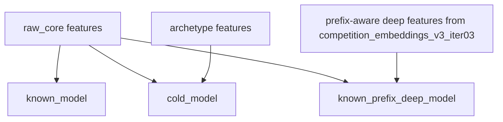
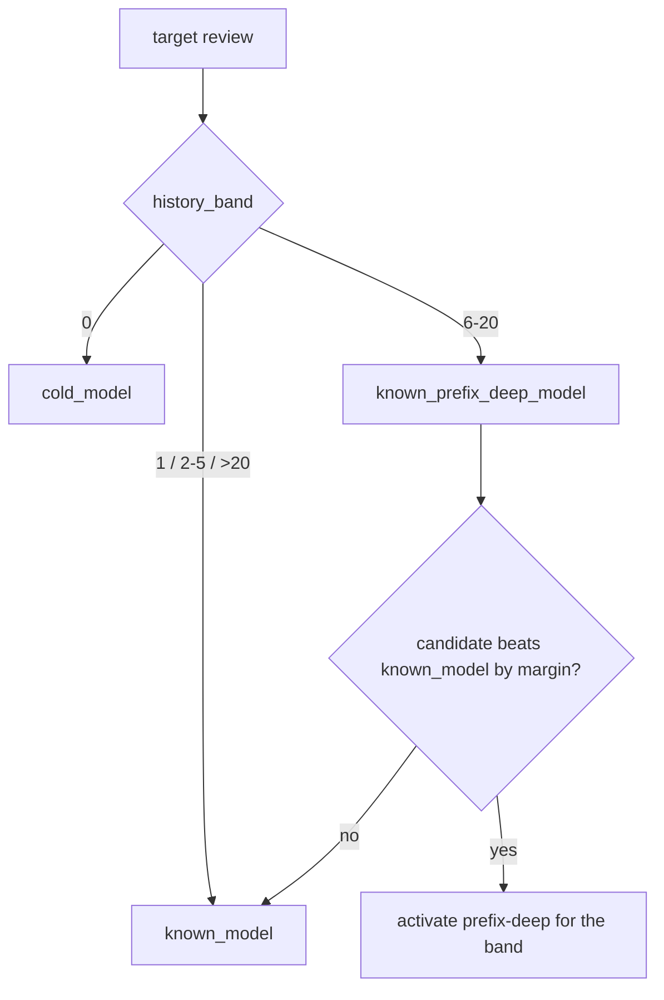

# Raw Router Prefix-Deep Experiment

Fecha: `2026-04-11`

## Objetivo

Cerrar la iteracion de router sobre `raw_core` incorporando una rama known-user prefix-deep para bandas cortas y medias, sin abandonar la rama cold basada en arquetipos.

## Estructura De Modelos

## Tecnicas De Enrutado

## Proceso Implementado

1. Se tomo `raw_core` como base del `known_model`.
2. Se mantuvo `cold_model` con arquetipos metadata-only para `history_band = 0`.
3. Se construyo una rama `known_prefix_deep_model` con:
   - embeddings de negocio desde `competition_embeddings_v3_iter03`
   - resumenes prefix-aware del historial
   - similitudes y distancias entre candidato e historial
   - estadisticas escalares del prefijo
4. Se evaluo la activacion por banda con un margen minimo de `0.005`.
5. Se exporto la politica final:
   - `0 -> cold_model`
   - `6-20 -> known_prefix_deep_model`
   - resto de usuarios conocidos -> `known_model`

## Resultado

Artefacto principal:

- [`content-based/artifacts/lgbm_raw_router_prefix_deep_v1`](/C:/Users/mario/OneDrive/Documentos/UPM/Master_Data/Sistemas_recomendacion/recomendation-system/content-based/artifacts/lgbm_raw_router_prefix_deep_v1)

Metricas locales:

- `router_validation_mae_rounded = 0.6265079379`
- baseline previo `lgbm_raw_router_v1 = 0.6268747449`
- mejora absoluta `-0.0003668069`

Bandas finales del router:

- `0 = 0.5896297693`
- `1 = 0.6980703473`
- `2-5 = 0.7357009649`
- `6-20 = 0.6845791340`
- `>20 = 0.6018933654`

Comparacion de la rama prefix-deep candidata:

- `1`
  - empeora a `0.7012391090`
  - no se activa
- `2-5`
  - mejora a `0.7327732444`
  - no supera el margen de activacion
- `6-20`
  - mejora a `0.6845791340`
  - queda activada

## Lectura

- el router nuevo es estable y end-to-end
- la mejora global frente a `lgbm_raw_router_v1` es pequena pero real
- la senal mas prometedora sigue estando en `6-20`
- `2-5` sigue siendo la banda mas interesante para la siguiente iteracion de perfilado de usuario

## Referencias

- [`validation_summary.json`](/C:/Users/mario/OneDrive/Documentos/UPM/Master_Data/Sistemas_recomendacion/recomendation-system/content-based/artifacts/lgbm_raw_router_prefix_deep_v1/validation_summary.json)
- [`training_summary.json`](/C:/Users/mario/OneDrive/Documentos/UPM/Master_Data/Sistemas_recomendacion/recomendation-system/content-based/artifacts/lgbm_raw_router_prefix_deep_v1/training_summary.json)
- [`feature_manifest.json`](/C:/Users/mario/OneDrive/Documentos/UPM/Master_Data/Sistemas_recomendacion/recomendation-system/content-based/artifacts/lgbm_raw_router_prefix_deep_v1/feature_manifest.json)

## Siguiente Paso Sugerido

Mejorar la representacion de usuarios en la banda `2-5` y revisar si hace falta una segmentacion aun mas fina dentro de los usuarios conocidos.
