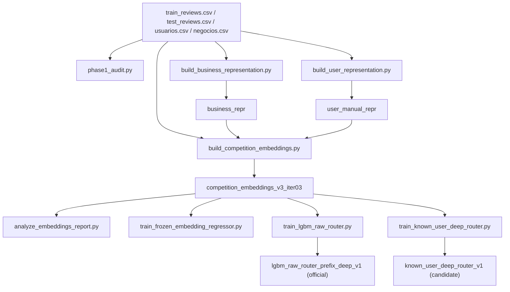

# Pipeline Operativo De Content-Based

- Proposito: describir el flujo real, ejecutable y actual de la rama `content-based`.
- Tipo documental: `current`
- Ultima actualizacion: `2026-04-11`

## Vista End-To-End

El pipeline actual de `content-based` tiene ocho etapas operativas:

1. auditoria de dataset y leakage
2. construccion de representacion de negocio
3. construccion de representacion manual de usuario
4. construccion de embeddings de competicion
5. reporte diagnostico de embeddings
6. regressor downstream sobre embeddings congelados
7. router LightGBM competitivo oficial
8. router deep de usuarios conocidos como rama experimental

## 1. Auditoria

Script:

- [`phase1_audit.py`](/C:/Users/mario/OneDrive/Documentos/UPM/Master_Data/Sistemas_recomendacion/recomendation-system/content-based/phase1_audit.py)

Objetivo:

- resumir dataset
- medir cold start
- auditar leakage de metadata
- resumir cobertura de parsers

## 2. Business Representation

Script:

- [`build_business_representation.py`](/C:/Users/mario/OneDrive/Documentos/UPM/Master_Data/Sistemas_recomendacion/recomendation-system/content-based/build_business_representation.py)

Output contractual principal:

- `business_ids.csv`
- `business_content_features.npz`
- `business_prior_features.npz`
- `business_full_features.npz`
- `business_feature_names.json`
- `business_block_summary.csv`
- `feature_metadata.csv`

## 3. Manual User Representation

Script:

- [`build_user_representation.py`](/C:/Users/mario/OneDrive/Documentos/UPM/Master_Data/Sistemas_recomendacion/recomendation-system/content-based/build_user_representation.py)

Output contractual principal:

- `user_ids.csv`
- `user_profile_features.npz`
- `user_metadata_features.npz`
- `user_full_features.npz`
- `user_feature_names.json`
- `user_feature_metadata.csv`

## 4. Competition Embeddings

Script:

- [`build_competition_embeddings.py`](/C:/Users/mario/OneDrive/Documentos/UPM/Master_Data/Sistemas_recomendacion/recomendation-system/content-based/build_competition_embeddings.py)

Subarboles generados:

- `business_repr/`
- `user_manual_repr/`
- `user_deep_repr/`

Outputs clave del deep bundle:

- `user_deep_features.npz`
- `business_deep_features.npz`
- `user_deep_summary.json`
- `deep_user_encoder_checkpoint.pt`

Snapshot oficial recomendado hoy:

- [`competition_embeddings_v3_iter03`](/C:/Users/mario/OneDrive/Documentos/UPM/Master_Data/Sistemas_recomendacion/recomendation-system/content-based/artifacts/competition_embeddings_v3_iter03)

## 5. Embedding Report

Script:

- [`analyze_embeddings_report.py`](/C:/Users/mario/OneDrive/Documentos/UPM/Master_Data/Sistemas_recomendacion/recomendation-system/content-based/analyze_embeddings_report.py)

Este reporte sirve para:

- coverage y health
- utilidad
- coherencia de negocio
- consistencia de usuario
- clustering
- homofilia social

Importante:

- es diagnostico
- no sustituye al protocolo formal de evaluacion y seleccion downstream

## 6. Frozen Regressor Downstream

Script:

- [`train_frozen_embedding_regressor.py`](/C:/Users/mario/OneDrive/Documentos/UPM/Master_Data/Sistemas_recomendacion/recomendation-system/content-based/train_frozen_embedding_regressor.py)

Salidas tipicas:

- `split_summary.json`
- `validation_summary.json`
- `band_metrics.csv`
- `validation_predictions.csv`
- `experiment_ranking.csv`
- `run_summary.json`

Estado actual:

- sigue siendo un protocolo diagnostico util
- no es el camino oficial de submission
- sus resultados historicos estuvieron muy condicionados por leakage cuando se reutilizaron embeddings exportados con historia completa

## 7. Router LightGBM Oficial

Scripts:

- training:
  - [`train_lgbm_raw_router.py`](/C:/Users/mario/OneDrive/Documentos/UPM/Master_Data/Sistemas_recomendacion/recomendation-system/content-based/train_lgbm_raw_router.py)
- submission export:
  - [`predict_lgbm_raw_router_submission.py`](/C:/Users/mario/OneDrive/Documentos/UPM/Master_Data/Sistemas_recomendacion/recomendation-system/content-based/predict_lgbm_raw_router_submission.py)

Artefacto oficial:

- [`lgbm_raw_router_prefix_deep_v1`](/C:/Users/mario/OneDrive/Documentos/UPM/Master_Data/Sistemas_recomendacion/recomendation-system/content-based/artifacts/lgbm_raw_router_prefix_deep_v1)

Router policy actual:

- `0 -> cold_model`
- `6-20 -> known_prefix_deep_model`
- otros usuarios conocidos -> `known_model`

Tecnicas de enrutado usadas:

- segmentacion dura por `history_band`
- rama cold basada en ausencia de historial
- activacion de rama prefix-deep solo si gana por margen en validacion
- fallback a `known_model` cuando falta feature prefix-deep o la banda no esta habilitada

## 8. Router Deep Known-User Experimental

Scripts:

- training:
  - [`train_known_user_deep_router.py`](/C:/Users/mario/OneDrive/Documentos/UPM/Master_Data/Sistemas_recomendacion/recomendation-system/content-based/train_known_user_deep_router.py)
- submission export:
  - [`predict_known_user_deep_router_submission.py`](/C:/Users/mario/OneDrive/Documentos/UPM/Master_Data/Sistemas_recomendacion/recomendation-system/content-based/predict_known_user_deep_router_submission.py)

Artefacto candidato:

- [`known_user_deep_router_v1`](/C:/Users/mario/OneDrive/Documentos/UPM/Master_Data/Sistemas_recomendacion/recomendation-system/content-based/artifacts/known_user_deep_router_v1)

Estado actual del experimento:

- implementado
- entrenado end-to-end
- no oficial
- no activa ninguna banda en el snapshot actual

## Flujo Recomendado Hoy

1. ejecutar auditoria
2. construir o refrescar embeddings de competicion
3. ejecutar reporte diagnostico del bundle exportado
4. usar frozen regressor solo como evaluacion secundaria o diagnostica
5. entrenar y validar el router oficial `train_lgbm_raw_router.py`
6. usar `train_known_user_deep_router.py` solo como linea candidata de investigacion
7. registrar snapshot y veredicto en `docs/experiments/registry.md`
