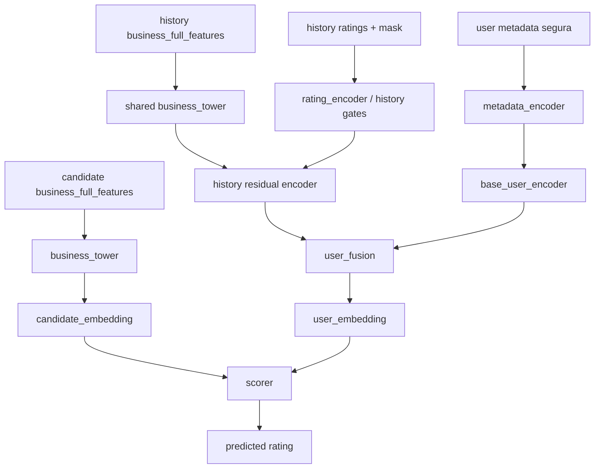

# Training Deep User De Content-Based

- Proposito: fijar el protocolo estable de entrenamiento de la familia deep exportadora actual.
- Tipo documental: `current`
- Ultima actualizacion: `2026-04-11`

## Objetivo

Entrenar un encoder profundo que exporta embeddings de usuario y negocio para:

- analisis diagnostico
- scorers downstream congelados
- ramas tabulares deep-aware como `known_prefix_deep_model`

La exportacion deep no es hoy la submission principal, pero sigue siendo la fuente oficial de representacion de negocio reutilizada por el router competitivo.

## Scripts Y Codigo Relevante

- builder y entrenamiento:
  - [`build_competition_embeddings.py`](/C:/Users/mario/OneDrive/Documentos/UPM/Master_Data/Sistemas_recomendacion/recomendation-system/content-based/build_competition_embeddings.py)
- implementacion principal:
  - [`deep_user_embeddings.py`](/C:/Users/mario/OneDrive/Documentos/UPM/Master_Data/Sistemas_recomendacion/recomendation-system/content-based/utils/deep_user_embeddings.py)
- modelo:
  - [`deep_user_encoder.py`](/C:/Users/mario/OneDrive/Documentos/UPM/Master_Data/Sistemas_recomendacion/recomendation-system/content-based/model/deep_user_encoder.py)

## Estructura Del Modelo

## Entradas Logicas

- `business_full_features` del candidato
- `business_full_features` del historial
- ratings historicos
- mascara de historial
- metadata segura del usuario

## Protocolo Estable

- construir arrays prefix-safe para train
- usar validacion temporal
- optimizar regresion de rating con `SmoothL1Loss`
- seleccionar mejor epoch por `val_mae`
- reentrenar el modelo final sobre todo el train con el numero de epochs seleccionado
- exportar embeddings de usuario y negocio

## Artefactos Generados

- `user_deep_ids.csv`
- `business_deep_ids.csv`
- `user_deep_features.npz`
- `business_deep_features.npz`
- `user_deep_feature_names.json`
- `user_deep_summary.json`
- `deep_user_encoder_checkpoint.pt`

## Rol Actual En La Arquitectura

La familia deep sigue siendo importante por tres motivos:

- genera el snapshot oficial `competition_embeddings_v3_iter03`
- mantiene snapshots candidatos como `competition_embeddings_v3_iter04`
- aporta embeddings de negocio al router oficial `lgbm_raw_router_prefix_deep_v1`

## Snapshots Relevantes

- oficial actual de export:
  - [`competition_embeddings_v3_iter03`](/C:/Users/mario/OneDrive/Documentos/UPM/Master_Data/Sistemas_recomendacion/recomendation-system/content-based/artifacts/competition_embeddings_v3_iter03)
- candidato de comparacion:
  - [`competition_embeddings_v3_iter04`](/C:/Users/mario/OneDrive/Documentos/UPM/Master_Data/Sistemas_recomendacion/recomendation-system/content-based/artifacts/competition_embeddings_v3_iter04)

## Relacion Con Otros Modelos

- `known_prefix_deep_model` no usa este encoder en inferencia end-to-end
- usa el bundle exportado por este pipeline para construir features tabulares por prefijo
- `known_user_deep_e2e_model` tampoco reutiliza los embeddings de usuario exportados
- reutiliza la representacion de negocio del bundle oficial como entrada densa para su propia red

## Lo Que No Debe Mezclarse Aqui

Este documento no es:

- un log de iteraciones historicas
- un RFC de una arquitectura nueva
- el contrato completo de artefactos

Para eso usar:

- [Log Deep User](/C:/Users/mario/OneDrive/Documentos/UPM/Master_Data/Sistemas_recomendacion/recomendation-system/docs/experiments/content-based-deep-user-log.md)
- [Decision Log](/C:/Users/mario/OneDrive/Documentos/UPM/Master_Data/Sistemas_recomendacion/recomendation-system/docs/architecture/decision-log.md)
- [Artefactos De Content-Based](/C:/Users/mario/OneDrive/Documentos/UPM/Master_Data/Sistemas_recomendacion/recomendation-system/docs/reference/content-based-artifacts.md)
