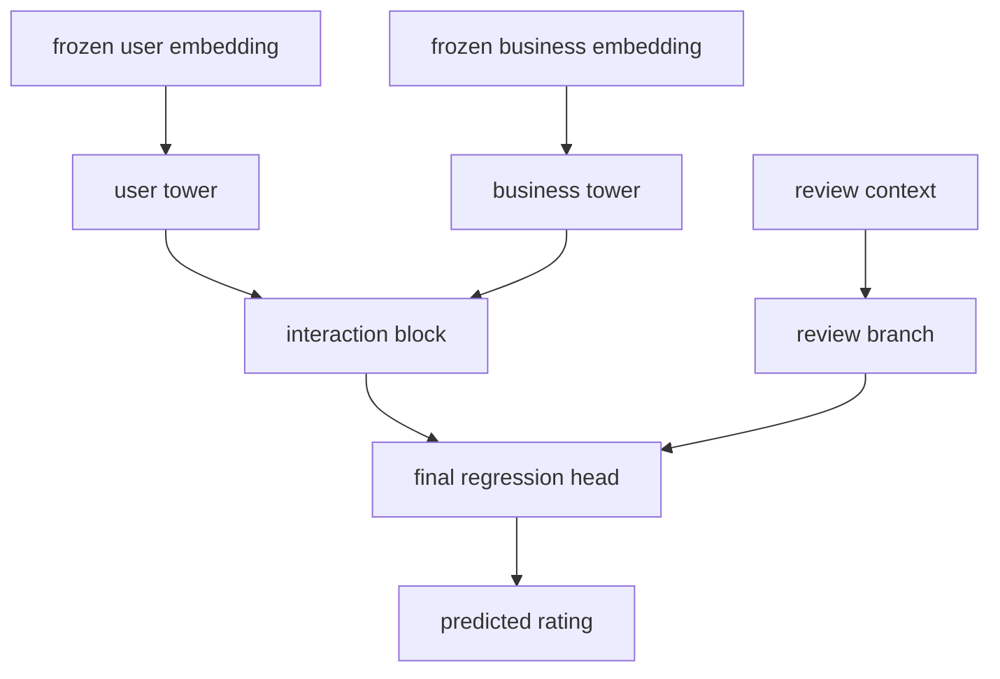

# Training Frozen Regressor De Content-Based

- Proposito: fijar el protocolo estable del entrenamiento downstream sobre embeddings congelados.
- Tipo documental: `current`
- Ultima actualizacion: `2026-04-11`

## Objetivo

Comparar modelos downstream sobre embeddings ya exportados para medir utilidad real de:

- `user_deep_features`
- `business_deep_features`
- `review_context`

Este flujo sigue siendo oficial para diagnostico y comparacion, pero ya no es el camino activo de submission principal. Esa posicion la ocupa ahora `lgbm_raw_router_prefix_deep_v1`.

## Scripts Y Codigo Relevante

- script principal:
  - [`train_frozen_embedding_regressor.py`](/C:/Users/mario/OneDrive/Documentos/UPM/Master_Data/Sistemas_recomendacion/recomendation-system/content-based/train_frozen_embedding_regressor.py)
- modelo MLP:
  - [`frozen_embedding_regressor.py`](/C:/Users/mario/OneDrive/Documentos/UPM/Master_Data/Sistemas_recomendacion/recomendation-system/content-based/model/frozen_embedding_regressor.py)
- joins y features downstream:
  - [`frozen_embedding_regression.py`](/C:/Users/mario/OneDrive/Documentos/UPM/Master_Data/Sistemas_recomendacion/recomendation-system/content-based/utils/frozen_embedding_regression.py)

## Estructura Del Modelo

## Protocolo Estable

- cargar bundles deep ya exportados
- construir split temporal train/validation
- comparar baseline Ridge y variantes MLP downstream
- medir `val_mae`, `val_rmse` y metricas por `history_band`
- seleccionar mejor experimento por `val_mae`
- si hay empate estrecho, preferir mejor comportamiento en bandas cortas

## Metricas

- primaria: `MAE`
- secundarias:
  - `RMSE`
  - `pairwise_auc`
  - metricas por `history_band`

## Artefactos Generados

- `split_summary.json`
- `validation_summary.json`
- `band_metrics.csv`
- `validation_predictions.csv`
- `experiment_ranking.csv`
- `run_summary.json`
- `checkpoint.pt`

## Run Recomendado Disponible

- [`frozen_embedding_regressor_v1`](/C:/Users/mario/OneDrive/Documentos/UPM/Master_Data/Sistemas_recomendacion/recomendation-system/content-based/artifacts/frozen_embedding_regressor_v1)

Ganador diagnostico sobre embeddings originales:

- `iter04_with_review`
- `val_mae = 0.3330`
- `pairwise_auc = 0.8073`
- `best_epoch = 18`
- bundle deep usado: [`competition_embeddings_v3_iter04`](/C:/Users/mario/OneDrive/Documentos/UPM/Master_Data/Sistemas_recomendacion/recomendation-system/content-based/artifacts/competition_embeddings_v3_iter04)

## Relacion Con El Router Actual

El frozen regressor quedo como referencia util para medir si el deep export aporta senal reutilizable. El router prefix-deep toma esa idea y la adapta a una politica por bandas:

- mantiene el `cold_model` para `0`
- mantiene `known_model` como fallback
- activa `known_prefix_deep_model` solo donde la mejora supera el margen requerido

En otras palabras: el frozen regressor sigue siendo una referencia valida, pero el deliverable competitivo vigente ahora es el router.

## Flujo Final De Competicion

Scripts:

- [`train_frozen_embedding_submission_model.py`](/C:/Users/mario/OneDrive/Documentos/UPM/Master_Data/Sistemas_recomendacion/recomendation-system/content-based/train_frozen_embedding_submission_model.py)
- [`predict_frozen_embedding_submission.py`](/C:/Users/mario/OneDrive/Documentos/UPM/Master_Data/Sistemas_recomendacion/recomendation-system/content-based/predict_frozen_embedding_submission.py)

Artefacto actual:

- [`frozen_embedding_submission_v1`](/C:/Users/mario/OneDrive/Documentos/UPM/Master_Data/Sistemas_recomendacion/recomendation-system/content-based/artifacts/frozen_embedding_submission_v1)

Configuracion usada en la version actual:

- source experiment: `iter04_with_review`
- embeddings: `competition_embeddings_v3_iter04`
- objetivo: `rating_regression`
- review context: `useful`, `funny`, `cool`, `date`
- entrenamiento final: `18` epocas sobre todo `train_reviews.csv`
- inferencia final: `clip` a `[1, 5]` y redondeo entero

Salida de competicion:

- CSV con exactamente dos columnas:
  - `ids`
  - `prediction`

La columna `ids` corresponde a `review_id` del `test_reviews.csv`.

## Notas

- Este protocolo es formal y evaluativo.
- El HTML de embeddings es util para diagnostico, pero no sustituye esta etapa.
