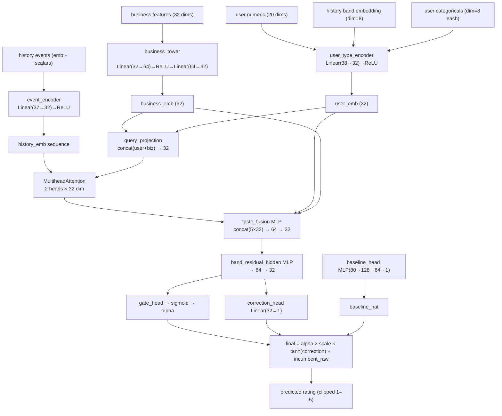

# Training — Lightweight Known-User Deep Corrector

- Proposito: documentar la arquitectura lightweight del deep corrector y su protocolo de entrenamiento.
- Tipo documental: `current`
- Ultima actualizacion: `2026-04-15`

## Objetivo

Entrenar un corrector residual de baja capacidad (~200k parametros) sobre las predicciones del incumbent LGBM router para usuarios conocidos con historial en las bandas 1, 2-5, 6-20 y >20. La arquitectura lightweight replica la estructura del modelo completo (`KnownUserDeepE2EModel`) pero con dimensiones reducidas para mejorar la generalizacion en bandas de entrenamiento sparse.

## Motivacion Del Disenio

El modelo completo tiene **3.28M parametros** entrenados sobre **337k ejemplos** (0.10 ejemplos/param). Las bandas sparse — especialmente `>20` (6k filas) y `1` (43k filas en train) — estan en regimen de underfitting. La hipotesis es que un modelo mas pequeno fuerza representaciones mas generalizables.

### Comparacion De Dimensiones

| Componente | Modelo completo | Modelo lightweight |
|---|---|---|
| `embedding_dim` | 128 | **32** |
| `business_hidden_layers` | (512, 384, 256) | **(64,)** |
| `event_hidden_layers` | (128,) | (32,) |
| `user_hidden_layers` | (128,) | (32,) |
| `taste_hidden_layers` | (256, 128) | **(64, 32)** |
| `num_attention_heads` | 4 | **2** |
| Total params | 3,285,413 | **~200,000** |
| Ejemplos / param | 0.10 | **~1.7** |

La estructura del modelo (5 expertos de banda, alpha gate, corrector residual) se mantiene identica — solo cambian las dimensiones.

## Archivos Relevantes

- Arquitectura (compartida con modelo completo):
  - [`model/known_user_deep_e2e.py`](/C:/Users/mario/OneDrive/Documentos/UPM/Master_Data/Sistemas_recomendacion/recomendation-system/content-based/model/known_user_deep_e2e.py)
- Pipeline de entrenamiento (compartido):
  - [`pipelines/deep/train_known_user_deep.py`](/C:/Users/mario/OneDrive/Documentos/UPM/Master_Data/Sistemas_recomendacion/recomendation-system/content-based/pipelines/deep/train_known_user_deep.py)
- Script de lanzamiento lightweight:
  - [`pipelines/deep/train_lightweight_deep.py`](/C:/Users/mario/OneDrive/Documentos/UPM/Master_Data/Sistemas_recomendacion/recomendation-system/content-based/pipelines/deep/train_lightweight_deep.py)
- Utilidades de datos:
  - [`utils/known_user_deep_e2e.py`](/C:/Users/mario/OneDrive/Documentos/UPM/Master_Data/Sistemas_recomendacion/recomendation-system/content-based/utils/known_user_deep_e2e.py)

## Estructura Del Modelo

El modelo es identico en estructura a `KnownUserDeepE2EModel`. La familia lightweight se activa a traves del parametro `--config-family v_lightweight` que inyecta `embedding_dim=32` y capas reducidas.



## Protocolo De Entrenamiento

1. Cargar el incumbent LGBM stack desde `--incumbent-root` y predecir sobre train y val splits.
2. Preparar el contexto deep (`prepare_known_user_context`): arquetipos de usuario, spec de features, matrix de negocio.
3. Construir datasets de entrenamiento y evaluacion con las predicciones del incumbent como target de distilacion.
4. Entrenar con early stopping sobre val MAE (redondeado, para consistencia con la metrica de competicion).
5. Seleccionar el mejor epoch por val MAE.
6. Reentrenar modelo final sobre todo el train con `best_epoch + 1` epochs adicionales.
7. Evaluar: para cada banda, calcular `delta_mae = deep_mae - incumbent_mae`; activar en el router solo las bandas donde `delta_mae < -enable_margin`.

### Hiperparametros Recomendados (runA)

```python
KnownUserDeepTrainingConfig(
    embedding_dim=32,
    event_hidden_dim=32,
    user_type_hidden_dim=32,
    scorer_hidden_dim=64,
    business_hidden_layers=(64,),
    scorer_hidden_layers=(64, 32),
    num_attention_heads=2,
    dropout=0.20,
    batch_size=1024,
    learning_rate=1e-3,
    weight_decay=1e-4,
    max_epochs=40,
    early_stopping_patience=8,
    auxiliary_loss_weight=0.15,
    band_correction_scales={"1": 0.7, "2-5": 0.95, "6-20": 1.0, ">20": 0.95},
    band_distillation_weights={"1": 0.06, "2-5": 0.06, "6-20": 0.05, ">20": 0.04},
)
```

### Notas Importantes

- `dropout=0.25 + weight_decay=5e-4` (runB) es excesivo para este tamano de modelo: el early stopping se dispara en epoch 5 y solo activa banda 1 donde delta=0. No usar regularizacion tan fuerte.
- La distilacion (`band_distillation_weights`) es util para la banda 6-20: sin distilacion (runB), el modelo no aprende a corregir esa banda.
- `batch_size=1024` en lugar de 512 aprovecha mejor el GPU con este modelo mas pequeno.

## Lanzamiento

```bash
cd content-based
uv run python pipelines/deep/train_lightweight_deep.py \
    --max-runs 2 \
    --save-root artifacts/known_user_deep_lightweight_v1 \
    --incumbent-root artifacts/lgbm_raw_router_prefix_deep_v1
```

Para lanzar solo runA:

```bash
uv run python pipelines/deep/train_lightweight_deep.py --max-runs 1
```

Para cambiar el incumbent:

```bash
uv run python pipelines/deep/train_lightweight_deep.py \
    --incumbent-root artifacts/lgbm_router_v10_cf_archetype \
    --save-root artifacts/known_user_deep_lightweight_v2
```

Alternativamente, usando el script base directamente:

```bash
uv run python pipelines/deep/train_known_user_deep.py \
    --config-family v_lightweight \
    --save-root artifacts/known_user_deep_lightweight_v1 \
    --incumbent-root artifacts/lgbm_raw_router_prefix_deep_v1
```

## Artefactos Generados (Por Run)

Bajo `artifacts/<save-root>/runs/<run_name>/`:

- `known_user_deep_checkpoint.pt` — estado del modelo final y arquitectura
- `validation_summary.json` — metricas por banda, delta_mae, bandas activadas, politica de reemplazo
- `known_user_deep_training_summary.json` — resumen compacto del training result
- `known_user_deep_config.json` — feature contract, data config, training config
- `known_user_deep_validation_predictions.csv` — predicciones del modelo sobre val split

> Nota: el artefacto de router completo (`submission.csv`, `validation_summary.json` en el root, `known_user_deep_training_summary.json` en el root) **no se genera** cuando el training se interrumpe antes de la fase de submission. Para generar submission completa es necesario que el pipeline llegue al bloque final de `main()` en `train_known_user_deep.py`.

## Resultados De Referencia (v1, runA)

| Banda | Filas val | Incumbent MAE | Deep MAE | Delta |
|---|---|---|---|---|
| 1 | 21,144 | 0.6802 | 0.6802 | 0.000 |
| 2-5 | 23,568 | 0.7156 | 0.7155 | −0.000042 |
| **6-20** | **13,994** | **0.6595** | **0.6524** | **−0.00715** |
| >20 | 6,021 | 0.5835 | 0.5835 | 0.000 |
| **Overall (known val)** | **64,727** | **0.6796** | **0.6780** | **−0.00156** |

Best epoch: 12 de 40. Best val MAE (deep): 0.6717.

## Relacion Con El Modelo Completo

| Aspecto | Modelo completo | Lightweight |
|---|---|---|
| Params | 3.28M | ~200k |
| Delta overall | ~−0.0035 | −0.00156 |
| Delta banda 6-20 | ~−0.003 | **−0.00715** |
| Bandas activadas | 1, 2-5, 6-20, >20 | 1, 6-20 |
| Tiempo de entrenamiento | ~60 min (GPU RTX 3060) | ~15 min |

La arquitectura lightweight es **preferible cuando el objetivo es la banda 6-20** o cuando el tiempo de entrenamiento es un factor limitante. El modelo completo sigue siendo necesario para activar la banda 2-5 con delta significativo.
