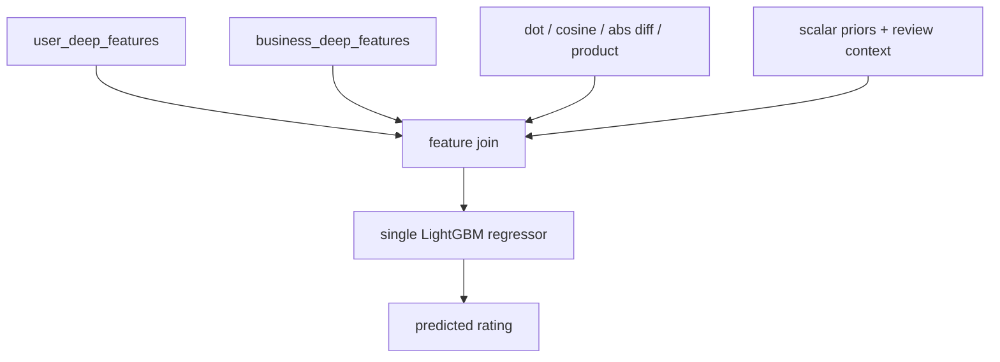

# Content-Based LGBM Deep Embeddings

- Date: `2026-04-10`
- Status: `implemented`
- Scope: a single LightGBM regressor over the existing deep embedding bundle, with a full-train submission export

## What This Pipeline Does

This pipeline replaces the deep regressor in the final export path with a single LightGBM model that consumes:

- user deep embeddings from `competition_embeddings_v3_iter04`
- business deep embeddings from the same bundle
- elementwise interaction features between user and business embeddings
- scalar priors recomputed from `train_reviews.csv`
- review-context features from the train/test reviews themselves

The model keeps the cold-start behavior explicit:

- `is_new_user` is computed against `train_reviews.csv`
- user-side embedding features are masked to zero when the row is cold start
- synthetic cold-start rows are injected during training so the tree model sees `history_count = 0`

## Estructura Del Modelo



## Artifact Layout

Validation run:

- `content-based/artifacts/lgbm_deep_embeddings_v1`

Submission run:

- `content-based/artifacts/lgbm_deep_embeddings_submission_v1`

Expected files:

- `model.pkl`
- `config.json`
- `scalar_priors.json`
- `review_context_scaler.json`
- `embedding_root.json`
- `validation_summary.json`
- `validation_predictions.csv`
- `feature_importance.csv`
- `submission.csv`
- `submission_summary.json`

## Validation Command

Run from the `content-based/` directory:

```bash
python train_lgbm_deep_embeddings.py --save-root artifacts/lgbm_deep_embeddings_v1 --synthetic-cold-start-fraction 0.3 --n-estimators 300 --early-stopping-rounds 30
```

This does a temporal split over `train_reviews.csv`, fits the LightGBM model, and saves the validation artifacts plus the best iteration.

## Submission Command

Run from the `content-based/` directory after the validation run exists:

```bash
python predict_lgbm_deep_embeddings_submission.py --source-run artifacts/lgbm_deep_embeddings_v1 --save-root artifacts/lgbm_deep_embeddings_submission_v1
```

That command:

- reloads the validation configuration
- retrains LightGBM on the full `train_reviews.csv`
- reuses the same deep embedding bundle
- writes the final `submission.csv` with columns `review_id,stars`

## Notes

- The canonical deep bundle family is now documented around `competition_embeddings_v3_*`
- This pipeline remains useful as a single-model embedding baseline
- It is no longer the official competition path
- The official path is the routed LightGBM stack in `lgbm_raw_router_prefix_deep_v1`
