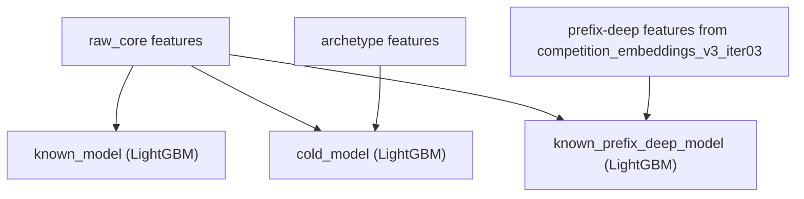
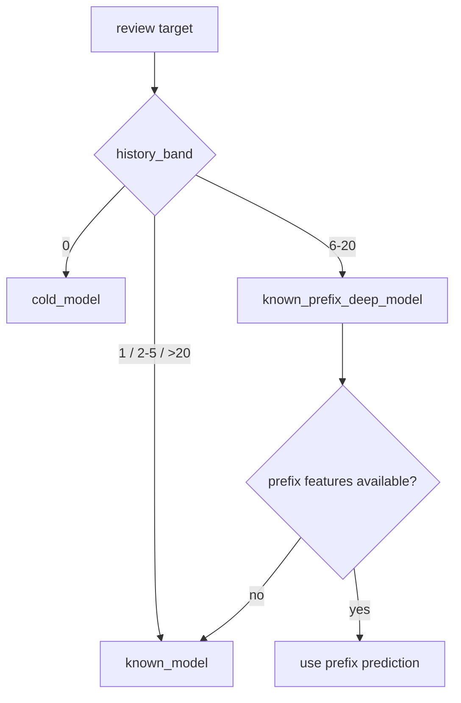

# Content-Based LGBM Raw Router

- Date: `2026-04-11`
- Status: `implemented`
- Scope: routed LightGBM stack with `raw_core` for known users, archetype-enriched cold start, and a prefix-deep branch for the known-user bands that still need more user profiling

## Goal

Keep the winning `raw_core` path intact for long-history users while adding two specializations:

- an archetype-based cold branch for users with no history
- a prefix-aware deep branch for known users in the short and medium history bands

The router is now the current competition submission path.

## Estructura Del Modelo



## Tecnicas De Enrutado



## Router Design

The current router has three branches:

- `known_model`
  - trains on the original `raw_core` features
  - is the fallback for known users outside the prefix-deep activation band
- `cold_model`
  - trains on `raw_core` plus archetype features
  - is used when `history_band = 0`
- `known_prefix_deep_model`
  - trains on `raw_core` plus prefix-aware deep features built from `competition_embeddings_v3_iter03`
  - is enabled only for `history_band = 6-20` in the current run

Routing policy in the current snapshot:

- `0 -> cold_model`
- `6-20 -> known_prefix_deep_model`
- other known users -> `known_model`

## Why This Version Exists

The previous router with archetypes solved cold start better than plain `raw_core`, but it did not improve the known-user bands enough.

This iteration keeps the cold branch and adds a prefix-deep branch specifically because:

- `1` got worse with the prefix-deep candidate
- `2-5` improved but not enough to clear the activation margin
- `6-20` improved enough to be activated

## Scripts

- training:
  - [`content-based/train_lgbm_raw_router.py`](/C:/Users/mario/OneDrive/Documentos/UPM/Master_Data/Sistemas_recomendacion/recomendation-system/content-based/train_lgbm_raw_router.py)
- submission export:
  - [`content-based/predict_lgbm_raw_router_submission.py`](/C:/Users/mario/OneDrive/Documentos/UPM/Master_Data/Sistemas_recomendacion/recomendation-system/content-based/predict_lgbm_raw_router_submission.py)
- archetype feature builder:
  - [`content-based/utils/lgbm_raw_router_features.py`](/C:/Users/mario/OneDrive/Documentos/UPM/Master_Data/Sistemas_recomendacion/recomendation-system/content-based/utils/lgbm_raw_router_features.py)

## Variables Used

Strong base variables preserved from `raw_core`:

- `user_average_stars`
- `business_stars`
- `user_minus_global_mean`
- `business_minus_global_mean`
- `user_business_metadata_gap`
- `user_review_count`
- `user_review_count_log1p`
- `user_engagement_log1p`
- `user_total_votes`
- `user_total_votes_log1p`
- `user_compliment_total`
- `user_compliment_log1p_total`
- `user_tenure_days`
- `user_tenure_years`
- `business_review_count`
- `business_review_count_log1p`
- `business_rating_per_review`
- `business_attributes_count`
- `business_attribute_true_count`
- `business_attribute_false_count`
- `business_attribute_string_count`
- review context from votes and time

User metadata used to build archetypes:

- `user_average_stars`
- `user_review_count_log1p`
- `user_tenure_years`
- `user_total_votes_log1p`
- `user_engagement_log1p`
- `user_friends_log1p`
- `user_elite_years_count`
- `user_compliment_log1p_total`
- `user_compliment_nonzero_count`

Generated archetype variables:

- `user_archetype_id`
- `user_metadata_completeness`
- `user_metadata_sparse_flag`
- `user_activity_bucket`
- `user_reputation_bucket`
- `user_tenure_bucket`
- `business_city_top`
- `business_primary_category_family`
- `business_star_bin`
- `archetype_train_mean`
- `archetype_train_support_count`
- `archetype_train_bias`
- `archetype_state_mean`
- `archetype_state_support_count`
- `archetype_city_mean`
- `archetype_city_support_count`
- `archetype_star_bin_mean`
- `archetype_star_bin_support_count`
- `archetype_open_mean`
- `archetype_open_support_count`
- `archetype_category_mean`
- `archetype_category_support_count`
- `archetype_business_star_gap`
- `archetype_state_gap`
- `archetype_category_gap`

Prefix-deep variables used by the activated known-user branch:

- candidate business embedding from `competition_embeddings_v3_iter03`
- `known_prefix_history_mean_emb_*`
- `known_prefix_history_recency_emb_*`
- `known_prefix_history_attn_emb_*`
- similarity and distance features between candidate and the prefix summaries
- prefix size and rating distribution features

## Variables Discarded

Directly excluded from router training:

- `user_known_in_train`
- `business_known_in_train`
- direct identifiers: `review_id`, `user_id`, `business_id`, `user`, `item`

Discarded feature families:

- `raw_priors user_train_*`
- `raw_priors business_train_*`
- `raw_priors city/state/postal train priors`
- deep user and business embeddings as direct regression targets
- raw free-text fields from friends, elite, categories, attributes, and hours

Canonical machine-readable manifests:

- [`feature_manifest.json`](/C:/Users/mario/OneDrive/Documentos/UPM/Master_Data/Sistemas_recomendacion/recomendation-system/content-based/artifacts/lgbm_raw_router_prefix_deep_v1/feature_manifest.json)
- [`discarded_variables.json`](/C:/Users/mario/OneDrive/Documentos/UPM/Master_Data/Sistemas_recomendacion/recomendation-system/content-based/artifacts/lgbm_raw_router_prefix_deep_v1/discarded_variables.json)

## Archetypes

The model fits `64` metadata-driven user archetypes with `MiniBatchKMeans`.

Each archetype profile stores:

- user count
- average metadata completeness
- average stars
- review-count intensity
- tenure
- engagement
- friends
- elite years
- compliment intensity

Full archetype documentation lives in:

- [`archetype_profiles.csv`](/C:/Users/mario/OneDrive/Documentos/UPM/Master_Data/Sistemas_recomendacion/recomendation-system/content-based/artifacts/lgbm_raw_router_prefix_deep_v1/archetype_profiles.csv)

## Current Run

Artifacts:

- [`content-based/artifacts/lgbm_raw_router_prefix_deep_v1`](/C:/Users/mario/OneDrive/Documentos/UPM/Master_Data/Sistemas_recomendacion/recomendation-system/content-based/artifacts/lgbm_raw_router_prefix_deep_v1)

Validation summary:

- router `validation_mae_rounded = 0.6265079379`
- baseline previous router `lgbm_raw_router_v1 = 0.6268747449`
- delta vs baseline `-0.0003668069`
- `known_model best_iteration = 1134`
- `cold_model best_iteration = 1997`
- `known_prefix_deep_model best_iteration = 621`
- branch row counts:
  - `cold_model = 128830`
  - `known_model = 50733`
  - `known_prefix_deep_model = 13994`
- final routed band metrics:
  - `0 = 0.5896`
  - `1 = 0.6981`
  - `2-5 = 0.7357`
  - `6-20 = 0.6846`
  - `>20 = 0.6019`

Known-prefix activation:

- `1` candidate MAE `0.7012`, not activated
- `2-5` candidate MAE `0.7328`, not activated
- `6-20` candidate MAE `0.6846`, activated

Submission:

- [`submission.csv`](/C:/Users/mario/OneDrive/Documentos/UPM/Master_Data/Sistemas_recomendacion/recomendation-system/content-based/artifacts/lgbm_raw_router_prefix_deep_v1/submission.csv)

## Commands

```bash
cd content-based
python train_lgbm_raw_router.py --save-root artifacts/lgbm_raw_router_prefix_deep_v1
python predict_lgbm_raw_router_submission.py --artifact-root artifacts/lgbm_raw_router_prefix_deep_v1 --save-path artifacts/lgbm_raw_router_prefix_deep_v1/submission.csv
```
