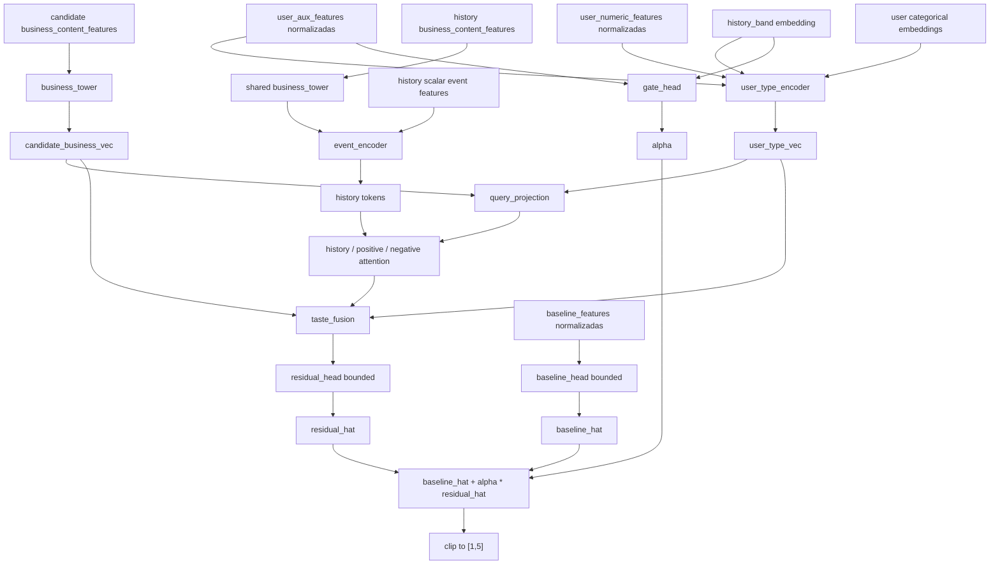
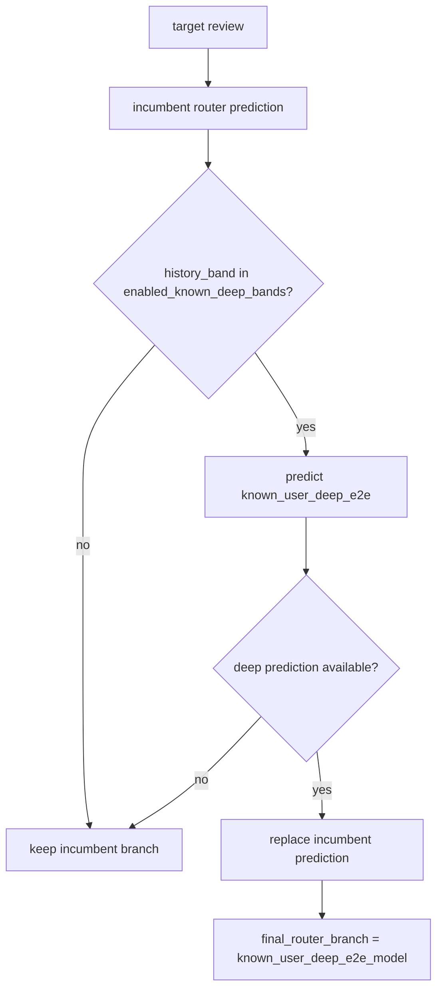

# `train_known_user_deep_router.py`: documentacion detallada

Fecha de auditoria: `2026-04-11`

## 1. Resumen ejecutivo

`content-based/train_known_user_deep_router.py` no entrena un router desde cero.

Lo que hace es:

1. cargar un router incumbent ya existente en `content-based/artifacts/lgbm_raw_router_prefix_deep_v1`
2. evaluar ese incumbent sobre una validacion temporal
3. entrenar una nueva rama `known_user_deep_e2e` solo para usuarios conocidos
4. comparar esa rama profunda por bandas de historial contra la prediccion del incumbent
5. activar la rama profunda solo en las bandas donde mejora con margen suficiente
6. reentrenar la mejor configuracion sobre todo `train_reviews`
7. exportar un nuevo artefacto de router mixto

La idea clave es esta:

- el router viejo ya tiene tres ramas: `cold_model`, `known_model` y `known_prefix_deep_model`
- el script nuevo no sustituye todo eso
- anade una cuarta posibilidad efectiva: `known_user_deep_e2e_model`
- pero solo para usuarios conocidos y solo en las bandas donde demuestre mejora

En el snapshot actual, el entrenamiento existe y el artefacto final se exporto, pero:

- `enabled_known_deep_bands = []`
- `known_user_deep_branch_rows = 0`
- el router final queda igual que el incumbent

## 2. Respuesta corta a tu duda sobre los embeddings `v3`

Si, los embeddings `v3` si se usan.

Pero no los usa todo el stack por igual:

- `known_model` no usa embeddings `v3`
  - es un LightGBM sobre `raw_core`
- `cold_model` tampoco usa embeddings `v3`
  - usa `raw_core` mas variables de arquetipos
- `known_prefix_deep_model` si usa embeddings `v3`
  - usa features prefijo construidas a partir de `competition_embeddings_v3_iter03`
- `known_user_deep_e2e_model` tambien usa embeddings `v3`
  - y los usa de forma mas directa que `known_prefix_deep_model`
  - consume la matriz `business_content_features.npz` del bundle `competition_embeddings_v3_iter03/business_repr`
  - esa matriz entra como representacion del negocio candidato y de cada negocio del historial

La confusion normal aqui viene de mezclar dos cosas distintas:

- usar embeddings como features tabulares derivadas para LightGBM
- usar embeddings como entrada densa nativa de una red profunda

En este script ocurren ambas.

## 3. Punto exacto donde entran los embeddings `v3`

## 3.1 Estructura Del Modelo `known_user_deep_e2e`

## 3.2 Tecnica De Enrutado

El script define por defecto:

- `--business-repr-root = content-based/artifacts/competition_embeddings_v3_iter03/business_repr`

Ese root se guarda en `KnownUserDeepDataConfig.business_repr_root` y luego se carga en:

- `prepare_known_user_context(...)`
- `load_safe_business_feature_block(...)`

Lo que se lee es:

- `business_ids.csv`
- `business_content_features.npz`
- `business_feature_names.json`

Importante:

- la vista cargada es `SAFE_BUSINESS_VIEW = "content"`
- no se usa una embedding aprendida del usuario
- se usa la representacion fija del negocio
- luego la red aprende a transformar esa representacion con `business_tower`

O sea:

- el embedding `v3` del negocio no es el predictor final
- es la materia prima de la rama deep

## 4. Estado conceptual del sistema antes de este script

El incumbent que carga `train_known_user_deep_router.py` viene de:

- `content-based/artifacts/lgbm_raw_router_prefix_deep_v1`

Ese incumbent ya define este enrutado:

- `history_band = 0 -> cold_model`
- `history_band in enabled_known_prefix_bands -> known_prefix_deep_model`
- resto de usuarios conocidos -> known_model

En el snapshot auditado:

- `enabled_known_prefix_bands = ["6-20"]`

Por tanto el incumbent real sirve asi:

- `0 -> cold_model`
- `6-20 -> known_prefix_deep_model`
- `1`, `2-5`, `>20` -> `known_model`

## 5. Estado real de artefactos hoy

### 5.1 Artefacto incumbent completo

Existe:

- [content-based/artifacts/lgbm_raw_router_prefix_deep_v1](/C:/Users/mario/OneDrive/Documentos/UPM/Master_Data/Sistemas_recomendacion/recomendation-system/content-based/artifacts/lgbm_raw_router_prefix_deep_v1)

Y su `validation_summary.json` muestra:

- `router_validation_mae_rounded = 0.6265079379`
- banda activada para prefix deep: `6-20`

### 5.2 Artefacto deep router nuevo

Existe el directorio:

- [content-based/artifacts/known_user_deep_router_v1](/C:/Users/mario/OneDrive/Documentos/UPM/Master_Data/Sistemas_recomendacion/recomendation-system/content-based/artifacts/known_user_deep_router_v1)

La corrida completa si existe.

Lo que hay ahora mismo es:

- `router_spec.joblib`
- `submission.csv`
- `validation_summary.json`
- `submission_summary.json`
- `known_user_deep_training_summary.json`
- `known_user_deep_checkpoint.pt`
- `learning_curves.csv`
- `runs/run01_base` a `runs/run05_low_aux`

Eso indica que, en este workspace, la rama `known_user_deep_router_v1` esta:

- implementada
- entrenada end-to-end
- exportada como snapshot candidato
- no consolidada aun como snapshot oficial de produccion

### 5.3 Resultado del snapshot exportado

En `known_user_deep_training_summary.json`:

- `best_run_name = run01_base`
- los cinco runs tienen `success = false`
- todos exportan `enabled_bands = []`

En `submission_summary.json`:

- `known_user_deep_branch_rows = 0`
- `enabled_known_deep_bands = []`

Conclusion:

- el incumbent actual sigue siendo el router `lgbm_raw_router_prefix_deep_v1`
- la rama `known_user_deep_e2e` no ha demostrado mejora en el snapshot exportado

## 6. Entradas globales del script

El script consume cuatro bloques principales:

### 6.1 Tablas base

Se cargan desde `utils.io`:

- `usuarios.csv`
- `negocios.csv`
- `train_reviews.csv`
- `test_reviews.csv`

Esquema normalizado de reviews tras `canonicalize_reviews(...)`:

- `user`
- `item`
- `rating` si existe
- `timestamp` si existe

### 6.2 Router incumbent

Se cargan desde `--incumbent-root`:

- `submission_router_spec.joblib`
- `known_submission_model.txt`
- `known_prefix_submission_model.txt`
- `cold_submission_model.txt`

### 6.3 Representacion de negocio para la rama deep

Se carga desde `--business-repr-root`:

- `business_ids.csv`
- `business_content_features.npz`
- `business_feature_names.json`

### 6.4 Hiperparametros del entrenamiento deep

Se controlan con:

- `max_history_len`
- `n_user_archetypes`
- `max_top_cities`
- `max_top_categories`
- `seed`
- y la lista interna de runs en `_load_run_configs(...)`

## 7. Split temporal y filosofia anti-leakage

El entrenamiento usa:

- `temporal_train_validation_split(train_reviews, val_size=0.2, timestamp_col="date")`

Esto hace:

1. ordenar `train_reviews` por tiempo
2. cortar el ultimo `20%` como validacion
3. usar el primer `80%` como contexto de entrenamiento

Luego, dentro de la rama deep, hay otra proteccion temporal adicional:

- en train, cada review usa solo su prefijo previo del mismo usuario
- en valid/test, cada target usa como historial un contexto fijo extraido solo de `context_reviews`

Eso evita que una review se vea a si misma dentro del historial.

## 8. Que significa `known`, `cold` y `history_band`

### 8.1 Usuario conocido

Para el stack raw/router, `user_known_in_train` significa:

- el `user_id` aparece en la tabla de priors de train

### 8.2 Usuario cold

Para el router actual, `cold_model` no significa solo “usuario totalmente nuevo”.
En la practica, la rama cold se activa cuando:

- `history_band = 0`

Como `history_band` se calcula desde el conteo historico del usuario, eso significa:

- sin historial de reviews previo disponible

### 8.3 Bandas de historial

La funcion `history_band_from_count` define:

- `0`
- `1`
- `2-5`
- `6-20`
- `>20`

La rama deep nueva solo se evalua para bandas conocidas:

- `1`
- `2-5`
- `6-20`
- `>20`

Nunca para `0`, porque el dataset deep filtra usuarios sin historial.

## 9. Como se obtiene la prediccion incumbent que sirve de referencia

La funcion `_predict_incumbent_router(...)` reconstruye el router actual asi:

1. crea `base_frame = build_raw_feature_frame(...)`
2. crea `router_frame = build_router_feature_frame(...)`
3. calcula `history_band` con `user_train_count`
4. predice `known_raw` con `known_booster`
5. predice `cold_raw` con `cold_booster`
6. si la banda esta habilitada, construye features prefix-deep y predice `known_prefix_raw`
7. resuelve la rama con `resolve_router_branches(...)`
8. si falta una prediccion prefix-deep, hace fallback a `known_model`
9. redondea con `_round_half_up`

Salida de esa fase:

- `review_id`
- `user`
- `item`
- `rating`
- `history_band`
- `incumbent_prediction_raw`
- `incumbent_prediction`
- `incumbent_branch`

## 10. Entrada exacta de la rama `known_user_deep_e2e`

La entrada no es un unico vector.
Es un conjunto multimodal de bloques.

## 10.1 Bloque A: negocio candidato

Para cada review target se toma:

- `candidate_item_idx`

Ese indice apunta a la fila del negocio en `business_content_features.npz`.

Luego, en inferencia del batch:

- `_gather_candidate_features(...)` recupera el vector del negocio
- `business_tower` lo proyecta a `candidate_business_vec`

## 10.2 Bloque B: historial de negocios del usuario

Para cada target se construye un prefijo de longitud maxima `max_history_len`.

Tensores:

- `history_item_idx`: ids indexados de negocios previos
- `history_ratings`: rating previo de cada evento
- `history_days`: dias desde cada evento hasta el target

En train:

- se construye con `_build_prefix_arrays_with_recency(...)`
- el historial crece dinamicamente review a review

En valid/test:

- se construye con `_build_fixed_context_arrays_with_recency(...)`
- el historial sale del bloque `context_reviews`

## 10.3 Bloque C: features escalares del evento historico

Cada evento del historial se convierte a 9 features:

- `rating`
- `rating_centered_user`
- `rating_centered_global`
- `liked_flag`
- `disliked_flag`
- `rating_abs_dev_user`
- `days_since_interaction`
- `log1p_days_since_interaction`
- `exp_decay_days_since_interaction`

Eso sale de `_build_history_rating_features(...)`.

Importante:

- el decaimiento temporal depende de `recency_half_life_days`
- por defecto la media vida es `180` dias
- el peso puede escalarse con `recency_weight_scale`

## 10.4 Bloque D: features numericas de usuario

Se meten en `user_numeric_features`:

- `user_average_stars`
- `user_review_count`
- `user_review_count_log1p`
- `user_total_votes`
- `user_total_votes_log1p`
- `user_engagement_log1p`
- `user_friends_count`
- `user_friends_log1p`
- `user_fans`
- `user_tenure_days`
- `user_tenure_years`
- `user_elite_years_count`
- `user_elite_any`
- `user_compliment_total`
- `user_compliment_log1p_total`
- `user_compliment_nonzero_count`
- `user_compliment_hot`
- `user_compliment_more`
- `user_compliment_profile`
- `user_compliment_cute`
- `user_compliment_list`
- `user_compliment_note`
- `user_compliment_plain`
- `user_compliment_cool`
- `user_compliment_funny`
- `user_compliment_writer`
- `user_compliment_photos`
- `user_metadata_completeness`
- `user_metadata_sparse_flag`
- `history_count`
- `history_count_log1p`

## 10.5 Bloque E: features auxiliares de usuario/historial

Se meten en `user_aux_features`:

- `history_count`
- `history_count_log1p`
- `history_rating_mean`
- `history_rating_std`
- `history_rating_min`
- `history_rating_max`
- `history_last_rating`
- `history_positive_share`
- `history_negative_share`
- `history_recency_days_mean`
- `user_metadata_completeness`
- `user_metadata_sparse_flag`

## 10.6 Bloque F: categoricas de usuario

Se codifican como ids enteros:

- `user_archetype_id`
- `user_activity_bucket`
- `user_reputation_bucket`
- `user_tenure_bucket`

Estas no vienen de embeddings `v3`.
Vienen del pipeline de router/arquetipos.

## 10.7 Bloque G: baseline features

La red no predice desde cero puro.
Tambien recibe un bloque base:

- `user_average_stars`
- `business_stars`
- `user_minus_global_mean`
- `business_minus_global_mean`
- `user_business_metadata_gap`
- `user_review_count_log1p`
- `business_review_count_log1p`
- `user_review_count_x_business_review_count`
- `review_total_votes`
- `review_useful`
- `review_funny`
- `review_cool`
- `review_days_since_train_start`
- `review_days_since_train_end`
- `business_rating_per_review`
- `business_attributes_count`
- `business_attribute_true_count`
- `business_attribute_false_count`
- `business_attribute_string_count`
- `business_weekly_open_minutes`
- `business_open_days_count`
- `business_weekend_days_open`
- `business_late_night_days`
- `business_latitude`
- `business_longitude`
- `business_geo_abs`

La cabeza `baseline_head` genera `baseline_hat`.

## 10.8 Bloque H: target

El target es:

- `rating`

Solo se mantienen filas con historial:

- `history_count > 0`

Por eso esta rama nunca cubre `cold`.

## 11. Transformaciones de datos paso a paso

## 11.1 Preparacion del contexto deep

`prepare_known_user_context(...)` construye:

1. `raw_spec` con `fit_raw_feature_spec(...)`
2. `router_spec` con `fit_router_feature_spec(...)`
3. carga la matriz de negocio `v3`
4. construye `feature_contract`

Ese `feature_contract` fija:

- nombres de columnas
- niveles categoricos
- longitud maxima de historial
- numero de summary tokens
- media global

## 11.2 Construccion del dataset train

`build_known_user_train_dataset(...)` hace:

1. normaliza reviews
2. mapea cada negocio a `item_idx`
3. ordena por `user`, `timestamp`, `item`
4. crea `raw_frame`
5. crea `router_frame`
6. construye arrays prefijo con recencia
7. materializa el dataset final

La parte mas importante es:

- cada fila usa solo reviews anteriores del mismo usuario

## 11.3 Construccion del dataset eval

`build_known_user_eval_dataset(...)` hace:

1. normaliza targets
2. normaliza contexto
3. crea `raw_frame` y `router_frame` usando specs fijados en train
4. para cada target busca el historial en `context_reviews`
5. materializa el dataset final

Aqui no se usa el propio target para construir su historial.

## 11.4 Materializacion final

`_materialize_known_user_dataset(...)`:

1. mezcla `raw_frame`, `router_frame` y `target_frame`
2. calcula `history_count` y `history_band`
3. calcula estadisticas escalares del historial
4. filtra `known_mask = history_count > 0`
5. genera arrays numpy finales
6. codifica categoricas
7. construye `history_rating_features`

Resultado:

- `KnownUserDeepPreparedDataset`

## 12. Arquitectura del modelo deep

La clase es:

- `content-based/model/known_user_deep_e2e.py -> KnownUserDeepE2EModel`

Tiene cinco subideas:

### 12.1 Torre de negocio

- `business_tower`
- transforma cada vector `v3` del negocio a un embedding latente de tamano `embedding_dim`

### 12.2 Encoder de eventos del historial

- combina embedding del negocio historico mas 9 features escalares del evento
- produce `event_vec` por interaccion

### 12.3 Encoder de tipo de usuario

Combina:

- numericas de usuario
- auxiliares de historial
- embeddings de categoricas
- embedding de `history_band`

Y produce `user_type_vec`.

### 12.4 Atencion sobre historial

Construye varios contextos:

- `history_context`
- `positive_context`
- `negative_context`

Ademas genera 4 `summary_tokens`:

- media simple
- media de positivos
- media de negativos
- media ponderada por recencia

La query de atencion se forma con:

- `candidate_business_vec`
- `user_type_vec`

### 12.5 Descomposicion baseline + residual

La prediccion final no es monolitica.
Se separa en:

- `baseline_hat`
- `residual_hat`

Y una puerta:

- `alpha = sigmoid(gate_head(...))`

Prediccion final:

- `predicted_rating = clamp(baseline_hat + alpha * residual_hat, 1, 5)`

Esto significa:

- la red aprende una base tabular estable
- y luego corrige con una componente dependiente del gusto secuencial del usuario

### 12.6 Cambio importante en la version actual del codigo

La version actual del codigo ya no mete los bloques tabulares en crudo.

Ahora:

- `baseline_features` se normaliza con estadisticas del contexto de train
- `user_numeric_features` se normaliza
- `user_aux_features` se normaliza
- `history_rating_features` se normaliza

Y ademas:

- `baseline_hat = global_mean + 2.0 * tanh(baseline_raw)`
- `residual_hat = 1.5 * tanh(residual_raw)`

Objetivo de este cambio:

- evitar que `baseline_hat` explote a cientos
- evitar el colapso de la salida a `5.0`
- hacer comparables runs con hiperparametros distintos

## 13. Funcion de perdida

La loss es:

- `smooth_l1` sobre rating
- `binary_cross_entropy_with_logits` para `like_logits`
- `binary_cross_entropy_with_logits` para `dislike_logits`

Por tanto la supervision tiene:

- objetivo principal de rating
- dos objetivos auxiliares:
  - `like_target = rating >= 4`
  - `dislike_target = rating <= 2`

## 14. Como se decide si una banda activa la rama deep

Tras predecir validacion:

1. se calcula MAE por banda del incumbent
2. se calcula MAE por banda del deep
3. se define `delta = deep_mae - incumbent_mae`
4. la banda se activa si:
   - `delta <= -known_enable_margin`

Por defecto:

- `known_enable_margin = 0.002`

Es decir:

- no basta con empatar
- debe ganar con margen

## 15. Como queda el router final si una banda mejora

En validacion y luego en test:

1. se empieza con la prediccion incumbent
2. se localizan las filas cuya `history_band` esta en `enabled_bands`
3. si la rama deep tiene prediccion para esa fila, reemplaza la del incumbent
4. `final_router_branch` pasa a ser `known_user_deep_e2e_model`

Si ninguna banda mejora:

- no se sustituye nada
- el router final es efectivamente igual al incumbent

## 16. Donde estan `cold` y `known` en este pipeline

## 16.1 `cold_model`

Esta totalmente fuera del entrenamiento deep.

Su papel aqui es:

- seguir viniendo del incumbent
- seguir atendiendo `history_band = 0`
- no se reentrena en este script

## 16.2 `known_model`

Tambien viene del incumbent.

Su papel aqui es:

- actuar como baseline fuerte para usuarios conocidos
- servir de fallback cuando la banda no activa deep
- seguir cubriendo las bandas no mejoradas

## 16.3 `known_prefix_deep_model`

Tambien viene del incumbent.

Su papel aqui es:

- seguir activo en las bandas prefix-deep ya aprobadas
- actualmente `6-20` en el snapshot incumbent

## 16.4 `known_user_deep_e2e_model`

Es la unica rama realmente nueva de este script.

Su papel es:

- intentar reemplazar al incumbent en ciertas bandas conocidas
- usando historial secuencial y representacion `v3` del negocio

## 17. Diferencia exacta entre `known_prefix_deep_model` y `known_user_deep_e2e_model`

### 17.1 `known_prefix_deep_model`

- modelo: LightGBM
- entrada deep: features tabulares derivadas de embeddings `v3`
- resumen de historial: media, recencia, atencion, similitudes
- salida: rating directo tipo booster

### 17.2 `known_user_deep_e2e_model`

- modelo: red neuronal end to end
- entrada deep: vectores de negocio `v3` crudos mas features de evento y usuario
- resumen de historial: aprendido internamente con `business_tower`, `event_encoder` y atencion
- salida: `baseline_hat + alpha * residual_hat`

La diferencia esencial:

- prefix deep convierte embeddings a tabla y luego usa boosting
- known deep usa los embeddings como tensores dentro de una red secuencial

## 18. Salidas y artefactos esperados del script

Si la corrida termina completa, deberia dejar en `save_root`:

- `router_spec.joblib`
- `submission.csv`
- `validation_summary.json`
- `submission_summary.json`
- `known_user_deep_config.json`
- `known_user_deep_training_summary.json`
- `enabled_bands.json`
- `known_user_deep_checkpoint.pt`
- `known_user_deep_validation_predictions.csv`
- `learning_curves.csv`

Y por cada run:

- `runs/<run_name>/known_user_deep_checkpoint.pt`
- `runs/<run_name>/known_user_deep_config.json`
- `runs/<run_name>/known_user_deep_training_summary.json`
- `runs/<run_name>/validation_summary.json`
- `runs/<run_name>/known_user_deep_validation_predictions.csv`

## 19. Lectura correcta de “en que punto estan los modelos”

En el estado actual del repo:

- `cold_model`
  - entrenado y activo dentro del incumbent `lgbm_raw_router_prefix_deep_v1`
- `known_model`
  - entrenado y activo dentro del mismo incumbent
- `known_prefix_deep_model`
  - entrenado y activo para `6-20` dentro del mismo incumbent
- `known_user_deep_e2e_model`
  - implementado y entrenado en `known_user_deep_router_v1`
  - no consolidado aun como router final oficial
  - el snapshot exportado no activa ninguna banda

## 20. Respuesta final, en lenguaje directo

No, no estas cargando los embeddings `v3` “para nada”.

Lo que pasa es:

- el `known_model` clasico no los usa
- el `cold_model` tampoco
- la rama `known_prefix_deep_model` ya los usaba como features agregadas
- y `train_known_user_deep_router.py` los usa otra vez, pero para una rama distinta y mas profunda: `known_user_deep_e2e_model`

Dicho de otra forma:

- los embeddings `v3` no son del router completo
- son del subsistema deep
- el script los necesita porque esta intentando meter una nueva rama deep en el router

Si quieres, el siguiente paso util que puedo hacer es auditar la nueva corrida despues de la correccion de normalizacion y salida acotada para ver si por fin aparece alguna banda competitiva.
